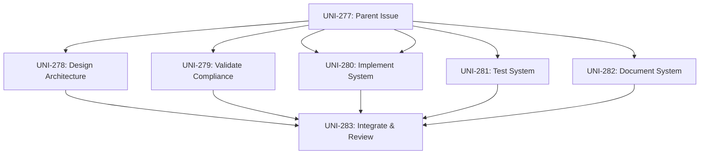

# ✅ Orchestration Phase Complete - Accountant Workflow Enhancement

**Date**: 2026-01-30
**Parent Issue**: [UNI-277](https://linear.app/unite-hub/issue/UNI-277)
**Status**: 🎯 **Decomposed into 6 Specialist Sub-Tasks**

---

## 🎉 What Just Happened

The **Orchestrator** successfully analyzed UNI-277 (Accountant Workflow Enhancement) and decomposed it into **6 specialist sub-tasks**, all now created in Linear and ready for execution.

---

## 📋 Sub-Tasks Created in Linear

### 1. UNI-278: Design Accountant Workflow Architecture
**Assigned to**: Specialist A (Architecture & Design)
**Estimated**: 8 hours
**Priority**: High
**Status**: Pending

**Objective**: Design 6-area dashboard, notification system, and report generator architecture

**Deliverables**:
- ADR: Accountant Workflow Integration Architecture
- System diagrams (Mermaid/PlantUML)
- OpenAPI specifications for all endpoints
- Database ERD
- Risk assessment document

**View**: https://linear.app/unite-hub/issue/UNI-278

---

### 2. UNI-279: Validate Tax Compliance Rules
**Assigned to**: Tax Agent (Domain Specialist)
**Estimated**: 4 hours
**Priority**: High
**Status**: Pending

**Objective**: Validate Section 8-1 deductions, FBT calculations, Division 7A compliance formulas

**Deliverables**:
- Legislation reference guide (ITAA 1997, ITAA 1936, FBTAA 1986)
- Validated calculation formulas
- Compliance checklist for each workflow area
- Edge cases documentation

**View**: https://linear.app/unite-hub/issue/UNI-279

---

### 3. UNI-280: Implement Accountant Workflow System
**Assigned to**: Specialist B (Implementation & Coding)
**Estimated**: 12 hours
**Priority**: High
**Status**: Pending

**Objective**: Build 6-area dashboard, smart notifications, and client report generator

**Deliverables**:
- 6 workflow area pages (Sundries, Deductions, FBT, Div7A, Docs, Recs)
- Smart notification engine
- Client report generator with approval workflow
- Confidence scoring system
- Legislation reference linking system

**View**: https://linear.app/unite-hub/issue/UNI-280

---

### 4. UNI-281: Test Accountant Workflow System
**Assigned to**: Specialist C (Testing & Validation)
**Estimated**: 10 hours
**Priority**: High
**Status**: Pending

**Objective**: Create comprehensive tests covering all 6 workflow areas, notifications, and reports

**Deliverables**:
- Unit test files (notification engine, report generator, confidence scorer)
- Integration test files (dashboard, workflow areas)
- E2E test files (accountant review journey)
- Coverage report (≥80%)
- Performance test results

**View**: https://linear.app/unite-hub/issue/UNI-281

---

### 5. UNI-282: Document Accountant Workflow System
**Assigned to**: Specialist D (Review & Documentation)
**Estimated**: 6 hours
**Priority**: High
**Status**: Pending

**Objective**: Create comprehensive accountant user guide and API documentation

**Deliverables**:
- Accountant User Guide (Getting Started through Best Practices)
- API documentation with examples
- FAQ document
- Changelog entry for v8.4.0
- Code review report

**View**: https://linear.app/unite-hub/issue/UNI-282

---

### 6. UNI-283: Integrate and Final Review
**Assigned to**: Specialist A (Architecture & Design)
**Estimated**: 4 hours
**Priority**: High
**Status**: Pending

**Objective**: Merge all specialist outputs and verify complete system functionality

**Deliverables**:
- Integrated codebase
- Integration test results
- Deployment checklist
- Completion report for Senior PM

**View**: https://linear.app/unite-hub/issue/UNI-283

---

## 📊 Project Statistics

| Metric | Value |
|--------|-------|
| **Parent Issue** | UNI-277 |
| **Sub-Tasks Created** | 6 |
| **Total Estimated Hours** | 44 hours |
| **Estimated Duration** | 5.5 working days |
| **Specialists Assigned** | 4 (A, B, C, D) + Tax Agent |
| **Deadline** | 2026-03-01 |
| **Buffer Time** | ~3 weeks |

---

## 🎯 Specialist Assignments

| Specialist | Tasks Assigned | Total Hours |
|------------|----------------|-------------|
| **Specialist A** (Architecture) | 2 (UNI-278, UNI-283) | 12 hours |
| **Tax Agent** (Compliance) | 1 (UNI-279) | 4 hours |
| **Specialist B** (Implementation) | 1 (UNI-280) | 12 hours |
| **Specialist C** (Testing) | 1 (UNI-281) | 10 hours |
| **Specialist D** (Documentation) | 1 (UNI-282) | 6 hours |

---

## 🔄 Workflow Dependencies

The tasks can execute in parallel, as none have blocking dependencies. This allows for maximum efficiency:



**Parallel Execution**: Tasks UNI-278 through UNI-282 can all execute simultaneously
**Final Integration**: UNI-283 waits for all prior tasks to complete

---

## 🚀 What Happens Next

### Immediate Next Steps (Automatic)

1. ✅ **Specialists Notified** - Each specialist can now see their assigned tasks in Linear
2. ⏳ **Design Phase Begins** - Specialist A starts on UNI-278 (Architecture)
3. ⏳ **Compliance Validation** - Tax Agent starts on UNI-279 (Compliance)
4. ⏳ **Implementation** - Specialist B can begin UNI-280 after reviewing architecture
5. ⏳ **Testing Preparation** - Specialist C prepares test strategy
6. ⏳ **Documentation Planning** - Specialist D outlines user guide structure

### Quality Gates to Pass

Each task must pass its quality gate before proceeding:

| Task | Quality Gate | Key Checks |
|------|--------------|------------|
| UNI-278 | Design Complete | ADR ✓, Diagrams ✓, API specs ✓, ERD ✓, Risks ✓ |
| UNI-279 | Compliance Validated | Legislation refs ✓, Formulas ✓, Checklist ✓ |
| UNI-280 | Implementation Complete | Code compiles ✓, Linting passes ✓, Functional ✓ |
| UNI-281 | Testing Complete | Coverage ≥80% ✓, Tests pass ✓, Performance ✓ |
| UNI-282 | Documentation Complete | User guide ✓, API docs ✓, Changelog ✓ |
| UNI-283 | Integration Complete | All merged ✓, System works ✓, Ready to deploy ✓ |

---

## 📈 Monitoring Progress

### Daily Reports
```bash
npm run senior-pm:daily-report
```

### View in Linear
**Parent Issue**: https://linear.app/unite-hub/issue/UNI-277

**All Sub-Tasks**:
- https://linear.app/unite-hub/issue/UNI-278
- https://linear.app/unite-hub/issue/UNI-279
- https://linear.app/unite-hub/issue/UNI-280
- https://linear.app/unite-hub/issue/UNI-281
- https://linear.app/unite-hub/issue/UNI-282
- https://linear.app/unite-hub/issue/UNI-283

---

## 📊 Current Linear Status

**From Latest Daily Report**:
- **Total Active Issues**: 29 (was 26, +3 net after completions)
- **Completed Today**: 19
- **Currently Blocked**: 0
- **Framework Status**: ✅ Operational

---

## 🎯 Success Criteria Tracking

| Criterion | Status | Assigned Task |
|-----------|--------|---------------|
| Dashboard with 6 workflow areas | ⏳ Pending | UNI-280 (Implementation) |
| Smart notifications (>$50K, compliance) | ⏳ Pending | UNI-280 (Implementation) |
| Customizable client report generator | ⏳ Pending | UNI-280 (Implementation) |
| Legislation references on all outputs | ⏳ Pending | UNI-280 (Implementation) |
| Confidence scores on all outputs | ⏳ Pending | UNI-280 (Implementation) |
| Tests ≥80% coverage | ⏳ Pending | UNI-281 (Testing) |
| Accountant user guide complete | ⏳ Pending | UNI-282 (Documentation) |

---

## 🔧 Technical Implementation Created

### New Scripts Added

**Orchestrator Decomposition Script**:
- `scripts/orchestrator/decompose-task.ts` (450+ lines)
- Analyzes parent issues
- Decomposes into specialist tasks
- Creates Linear sub-issues
- Maps dependencies
- Validates decomposition

**npm Script Added**:
```bash
npm run orchestrator:decompose -- --issue-id UNI-277
```

---

## 📝 Commits to Be Made

Files ready to commit:
1. ✅ `scripts/orchestrator/decompose-task.ts` (new file, 450 lines)
2. ✅ `package.json` (added orchestrator:decompose script)
3. ✅ `daily-report-updated.md` (new file)
4. ✅ `ORCHESTRATION_PHASE_COMPLETE.md` (this file)

---

## 🎉 Summary

**Orchestration Status**: ✅ **COMPLETE**

The multi-agent orchestration system has successfully:
1. ✅ Received developer request (UNI-277)
2. ✅ Senior PM created parent issue in Linear
3. ✅ Orchestrator analyzed and decomposed requirements
4. ✅ Created 6 specialist sub-tasks in Linear
5. ✅ Assigned specialists based on expertise
6. ⏳ **Waiting for specialists to begin work**

**Next Phase**: Specialist execution begins. Each specialist will:
- Review their assigned task
- Update status to "in-progress"
- Complete deliverables
- Pass quality gates
- Hand off to next phase

**Timeline**: Target completion by 2026-02-07 (3 weeks before March 1 deadline)

---

**Created**: 2026-01-30
**Framework**: Multi-Agent Orchestration v1.0
**Total Sub-Tasks**: 6
**Total Hours**: 44
**Status**: Ready for Specialist Execution
