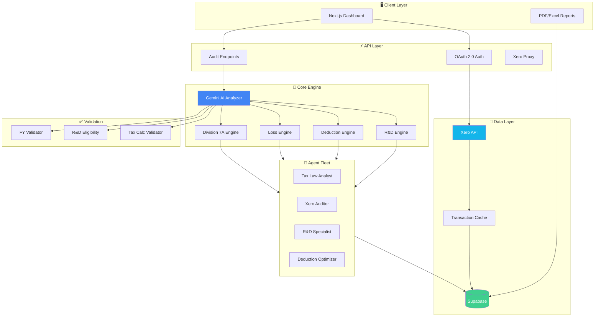
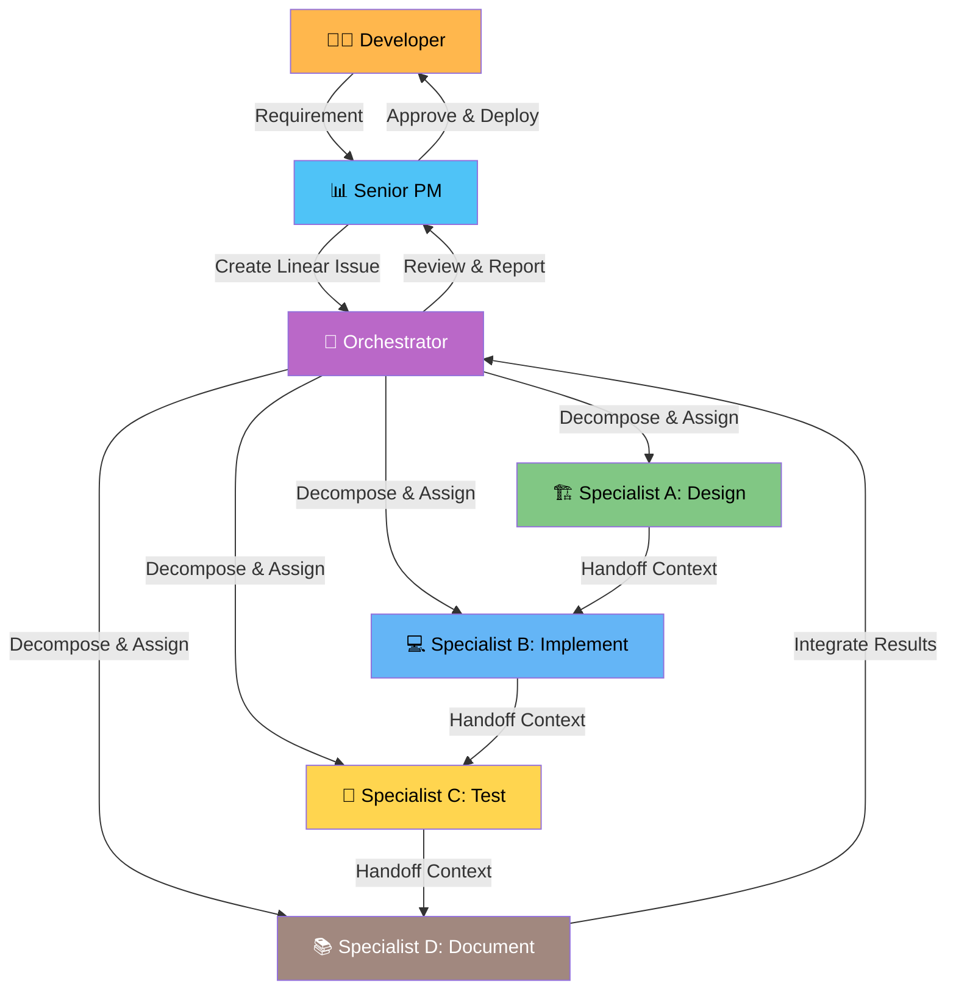

<div align="center">

<!-- PROJECT BANNER - Replace with your own banner image -->


# 🇦🇺 Australian Tax Optimizer

### AI-Powered Tax Recovery & Compliance Platform

[](https://nextjs.org/)
[](https://www.typescriptlang.org/)
[](https://supabase.com/)
[](https://developer.xero.com/)
[](https://ai.google.dev/)

[]()
[]()
[]()

**Recover $200K-$500K in missed tax benefits per client through forensic Xero analysis**

[Getting Started](#-quick-start) •
[Documentation](#-documentation) •
[API Reference](API_DOCUMENTATION.md) •
[Architecture](#-architecture)

</div>

---

## 🎯 What is ATO?

The **Australian Tax Optimizer** is an AI-powered platform that connects to your Xero accounting data (read-only) and performs forensic analysis to identify:

| Recovery Area | Potential Savings | Legislation |
|--------------|-------------------|-------------|
| 🔬 **R&D Tax Incentive** | Up to 43.5% offset | Division 355 ITAA 1997 |
| 📊 **Unclaimed Deductions** | Variable | Section 8-1 ITAA 1997 |
| 💰 **Carry-Forward Losses** | Tax offset on profits | Subdivision 36-A |
| 🏦 **Division 7A Compliance** | Avoid deemed dividends | Division 7A ITAA 1936 |
| 🎁 **FBT Optimisation** | Reduce FBT liability | FBTAA 1986 |

---

## 🏗 Architecture



---

## ✨ Features

<table>
<tr>
<td width="50%">

### 🔍 Forensic Analysis
- AI-powered transaction scanning
- Pattern recognition for R&D activities
- Misclassification detection
- Multi-year analysis (FY2020-25)

</td>
<td width="50%">

### 🛡️ Enterprise Security
- Read-only Xero access
- AES-256-GCM token encryption
- Multi-tenant isolation
- Row-level security (RLS)

</td>
</tr>
<tr>
<td width="50%">

### 🤖 16 Specialised Agents
- Tax Law Analyst
- R&D Tax Specialist
- Deduction Optimizer
- Loss Recovery Agent
- Division 7A Compliance
- And 11 more...

</td>
<td width="50%">

### 📊 Validation System
- 10 specialised validators
- 90-95% confidence scores
- Automatic fix instructions
- Compliance verification

</td>
</tr>
</table>

---

## 🤖 Multi-Agent Development Framework

This project employs a sophisticated multi-agent development framework that coordinates **4 specialist agents** plus an **orchestrator** for structured, quality-gated development.

### Agent Fleet

**Framework Agents** (Development Process):
- 🎯 **Orchestrator** - Task decomposition, work distribution, results synthesis, quality control
- 🏗️ **Specialist A: Architect** - System design, API schemas, database ERDs, architecture decision records (ADRs)
- 💻 **Specialist B: Developer** - Production code implementation, feature development, refactoring
- 🧪 **Specialist C: Tester** - Unit/integration/E2E testing, QA, coverage reports (≥80% target)
- 📚 **Specialist D: Reviewer** - Code review, technical documentation, API docs, user guides

**Tax Domain Agents** (Business Logic):
- 18 specialized agents for Australian tax analysis (R&D, deductions, losses, Division 7A, etc.)
- See [.agent/AGENTS.md](.agent/AGENTS.md) for complete agent registry

### Development Workflow



### Quality Gates

Every phase transition requires passing automated quality gates:

| Gate | Criteria | Blocks Phase |
|------|----------|--------------|
| ✅ Design Complete | ADR created, diagrams complete, risks documented | Implementation |
| ✅ Implementation Complete | Code compiles, linting passes, basic functionality works | Testing |
| ✅ Testing Complete | ≥80% coverage, all tests pass, no critical bugs | Documentation |
| ✅ Documentation Complete | API docs, changelog updated, examples provided | Integration |
| ✅ Integration Complete | All outputs merged, system functional, no conflicts | Final Approval |
| ✅ Final Approval | PM + Developer sign-off, ready for deployment | Deployment |

See `lib/agents/quality-gates.ts` for automated enforcement.

### Linear Integration

All development work is tracked in Linear with automated updates:

- 📝 **Task Creation** - Parent issues created from Developer requests
- 🔄 **Sub-Task Assignment** - Specialists automatically assigned via Linear sub-issues
- 📊 **Real-Time Updates** - Status transitions (pending → in-progress → review → done)
- 🚫 **Blocker Escalation** - Automatic escalation with @mentions in comments
- 📈 **Progress Tracking** - Daily reports showing specialist workload and velocity

**Quick Commands**:
```bash
npm run agent:orchestrator -- --task "Add feature" --priority High
npm run agent:daily-report                         # View daily status
npm run agent:quality-gate -- --gate <name>        # Check quality gate
npm run linear:sync                                # Sync with Linear
npm run linear:report                              # Generate comprehensive report
```

See [MULTI_AGENT_ARCHITECTURE.md](MULTI_AGENT_ARCHITECTURE.md) for complete framework specification.

---

## 🚀 Quick Start

<details>
<summary><strong>📋 Prerequisites</strong></summary>

- Node.js 20.x or higher
- npm 10.x or higher
- Xero Developer Account
- Supabase Project
- Google AI API Key (for Gemini)

</details>

<details>
<summary><strong>⚙️ Installation</strong></summary>

```bash
# Clone the repository
git clone https://github.com/CleanExpo/ATO.git
cd ATO

# Install dependencies
npm install

# Copy environment template
cp .env.example .env.local

# Configure your environment variables (see below)
```

</details>

<details>
<summary><strong>🔑 Environment Variables</strong></summary>

```env
# Supabase (Required)
NEXT_PUBLIC_SUPABASE_URL=https://your-project.supabase.co
NEXT_PUBLIC_SUPABASE_ANON_KEY=your-anon-key
SUPABASE_SERVICE_ROLE_KEY=your-service-role-key

# Xero OAuth (Required)
XERO_CLIENT_ID=your-xero-client-id
XERO_CLIENT_SECRET=your-xero-client-secret
XERO_REDIRECT_URI=https://your-domain.com/api/auth/xero/callback

# Google AI (Required for analysis)
GOOGLE_AI_API_KEY=your-gemini-api-key

# Security (Required for production)
TOKEN_ENCRYPTION_KEY=your-32-byte-hex-key  # Generate: openssl rand -hex 32
```

</details>

<details>
<summary><strong>🗄️ Database Setup</strong></summary>

```bash
# Run migrations via Supabase Dashboard SQL Editor
# Or use the migration script:
npm run db:migrate
```

Migration files are located in `supabase/migrations/`.

</details>

<details>
<summary><strong>▶️ Running the App</strong></summary>

```bash
# Development
npm run dev

# Production build
npm run build
npm start

# Run tests
npm test
```

</details>

---

## 📚 Documentation

| Document | Description |
|----------|-------------|
| [CLAUDE.md](CLAUDE.md) | AI development guidelines (RTCC pattern) |
| [MULTI_AGENT_ARCHITECTURE.md](MULTI_AGENT_ARCHITECTURE.md) | Multi-agent framework specification |
| [spec.md](spec.md) | Technical specification |
| [API_DOCUMENTATION.md](API_DOCUMENTATION.md) | Complete API reference |
| [FORENSIC_AUDIT_GUIDE.md](FORENSIC_AUDIT_GUIDE.md) | User guide for audits |
| [AGENTS_README.md](AGENTS_README.md) | Agent system documentation |
| [DATABASE_MIGRATIONS.md](DATABASE_MIGRATIONS.md) | Migration instructions |

---

## 🧪 Testing

```bash
# Run all tests
npm test

# Run with coverage
npm run test:coverage

# Run specific test file
npm test -- tests/unit/tax-calculations.test.ts

# Interactive UI
npm run test:ui
```

Current test coverage: **23 tests passing** across tax calculations, financial year validation, and core business logic.

---

## 📁 Project Structure

```
ATO/
├── app/                    # Next.js App Router
│   ├── api/               # 40 API endpoints
│   └── dashboard/         # Dashboard pages
├── lib/                   # Core business logic
│   ├── ai/               # Gemini AI integration
│   ├── analysis/         # Tax engines (R&D, deductions, losses)
│   ├── auth/             # Authentication middleware
│   ├── crypto/           # Token encryption
│   ├── validation/       # Zod schemas
│   └── xero/             # Xero client
├── .agent/               # 16 AI agents
├── .claude/              # Claude configuration & validators
├── scripts/              # Utility scripts
├── supabase/             # Database migrations
└── tests/                # Test suites
```

---

## 🔒 Security

| Feature | Implementation |
|---------|---------------|
| **Authentication** | Supabase Auth with JWT |
| **Authorisation** | Per-tenant access control |
| **Token Storage** | AES-256-GCM encryption |
| **API Security** | Rate limiting, input validation |
| **Xero Access** | Read-only scopes only |
| **Data Protection** | Row-level security (RLS) |

---

## 📜 Key Tax Legislation

| Legislation | Purpose | Key Rates (FY2024-25) |
|-------------|---------|----------------------|
| Division 355 ITAA 1997 | R&D Tax Incentive | 43.5% offset |
| Division 7A ITAA 1936 | Private Company Loans | 8.77% benchmark |
| Section 8-1 ITAA 1997 | General Deductions | Business purpose test |
| Subdivision 36-A ITAA 1997 | Tax Losses | COT/SBT compliance |
| Subdivision 328-D ITAA 1997 | Instant Asset Write-Off | $20,000 threshold |
| FBTAA 1986 | Fringe Benefits Tax | 47% rate |

---

## ⚖️ Disclaimer

```
This software provides tax analysis and recommendations for informational purposes only.
It does not constitute tax advice. All recommendations should be reviewed by a qualified
tax professional before implementation. The software operates in READ-ONLY mode and
will never modify your Xero data or submit ATO filings.
```

---

## 🔗 Links

- [Xero Developer Portal](https://developer.xero.com/)
- [Australian Taxation Office](https://www.ato.gov.au/)
- [R&D Tax Incentive Guide](https://www.ato.gov.au/businesses-and-organisations/income-deductions-and-concessions/research-and-development-tax-incentive)
- [Division 7A Calculator](https://www.ato.gov.au/calculators-and-tools/division-7a-calculator)

---

<div align="center">

**Built with ❤️ for Australian Businesses**

[](https://vercel.com)

</div>
