# Senior PM: Multi-Agent Orchestration Workflow

**Status**: Production Ready
**Version**: 1.0
**Last Updated**: 2026-01-30

---

## Overview

The Senior Project Manager (Enhanced) coordinates two critical workflows in the ATO platform:

1. **Idea Intake Workflow** - Queue-based idea validation and routing
2. **Multi-Agent Orchestration Workflow** - Coordinated development with 4 specialist agents

This document focuses on the **Multi-Agent Orchestration Workflow**.

---

## Workflow Diagram

```mermaid
graph TD
    A[👨‍💼 Developer] -->|Submit Request| B[📊 Senior PM]
    B -->|Create Parent Issue| C[🔗 Linear]
    B -->|Assign Task| D[🎯 Orchestrator]

    D -->|Decompose| E[Task Analysis]
    E -->|Create Sub-Issues| C

    D -->|Assign| F[🏗️ Specialist A: Architect]
    D -->|Assign| G[💻 Specialist B: Developer]
    D -->|Assign| H[🧪 Specialist C: Tester]
    D -->|Assign| I[📚 Specialist D: Reviewer]

    F -->|Design Complete| J[✅ Quality Gate 1]
    J -->|Pass| G
    G -->|Code Complete| K[✅ Quality Gate 2]
    K -->|Pass| H
    H -->|Tests Complete| L[✅ Quality Gate 3]
    L -->|Pass| I
    I -->|Docs Complete| M[✅ Quality Gate 4]
    M -->|Pass| D

    D -->|Integration| N[✅ Quality Gate 5]
    N -->|Pass| B
    B -->|Final Review| O[✅ Quality Gate 6]
    O -->|Approve| A

    style A fill:#FFB74D,color:#000
    style B fill:#4FC3F7,color:#000
    style D fill:#BA68C8,color:#fff
    style F fill:#81C784,color:#000
    style G fill:#64B5F6,color:#000
    style H fill:#FFD54F,color:#000
    style I fill:#A1887F,color:#fff
    style J fill:#66BB6A,color:#fff
    style K fill:#66BB6A,color:#fff
    style L fill:#66BB6A,color:#fff
    style M fill:#66BB6A,color:#fff
    style N fill:#66BB6A,color:#fff
    style O fill:#66BB6A,color:#fff
```



---

## Workflow Phases

### Phase 1: Developer Request → Senior PM

**Trigger**: Developer submits a new project request

**Script**: `npm run senior-pm:orchestrate`

**Example**:
```bash
npm run senior-pm:orchestrate -- \
  --title "Add R&D Eligibility Checker API" \
  --description "Create endpoint to validate R&D activities against Division 355" \
  --priority High \
  --type feature \
  --success-criteria "API functional,Tests ≥80%,Documentation complete"
```

**Senior PM Actions**:
1. ✅ Validates request (title, description, success criteria)
2. 📝 Creates Linear parent issue
3. 📊 Initializes project tracking
4. 📨 Sends message to Orchestrator

**Output**:
```
✅ Request Accepted

Linear Issue: ATO-123
URL: https://linear.app/unite-hub/issue/ATO-123

📨 Message sent to Orchestrator for task decomposition
```

---

### Phase 2: Orchestrator Task Decomposition

**Trigger**: Orchestrator receives task assignment from Senior PM

**Orchestrator Actions**:
1. 📖 Analyzes requirements
2. 🧩 Decomposes into specialist tasks
3. 🔗 Identifies dependencies
4. 📋 Creates task proposals

**Example Decomposition**:
```markdown
ORCH-001: Design API Schema (Specialist A)
- Dependencies: None
- Deliverables: ADR, OpenAPI spec, ERD
- Estimated: 4 hours

ORCH-002: Validate Division 355 Compliance (Tax Agent)
- Dependencies: ORCH-001
- Deliverables: Compliance rules, validation logic
- Estimated: 3 hours

ORCH-003: Implement API Endpoint (Specialist B)
- Dependencies: ORCH-001, ORCH-002
- Deliverables: route.ts, business logic
- Estimated: 6 hours

ORCH-004: Write Integration Tests (Specialist C)
- Dependencies: ORCH-003
- Deliverables: Test files, coverage ≥80%
- Estimated: 4 hours

ORCH-005: Document API (Specialist D)
- Dependencies: ORCH-003, ORCH-004
- Deliverables: API docs, changelog
- Estimated: 2 hours
```

**Orchestrator → Senior PM**:
Sends decomposition for approval

**Senior PM Review**:
1. ✅ Validates task IDs (ORCH-### pattern)
2. ✅ Checks for circular dependencies
3. ✅ Approves decomposition
4. 📝 Creates Linear sub-issues
5. 📊 Updates project tracking

---

### Phase 3: Specialist Execution (Parallel)

#### Specialist A: Architecture & Design

**Trigger**: Receives ORCH-001 assignment

**Tasks**:
1. Design system architecture
2. Create API schema (OpenAPI)
3. Design database ERD
4. Write Architecture Decision Record (ADR)
5. Document risks and mitigations

**Deliverables**:
- `docs/adr/ADR-015-rnd-eligibility-api.md`
- `docs/api-specs/rnd-eligibility-openapi.yaml`
- `docs/database/rnd-tables-erd.md`

**Quality Gate**: ✅ Design Complete
- [ ] ADR exists
- [ ] System diagrams complete
- [ ] Risks documented

**Handoff**: → Specialist B (Implementation)

---

#### Specialist B: Implementation & Coding

**Trigger**: Design Complete gate passed

**Tasks**:
1. Implement API route
2. Write business logic
3. Integrate with tax agents
4. Handle errors gracefully
5. Pass linting and compilation

**Deliverables**:
- `app/api/rnd/eligibility-checker/route.ts`
- `lib/rnd/eligibility-checker.ts`

**Quality Gate**: ✅ Implementation Complete
- [ ] Code compiles
- [ ] Linting passes
- [ ] Basic functionality works

**Handoff**: → Specialist C (Testing)

---

#### Specialist C: Testing & Validation

**Trigger**: Implementation Complete gate passed

**Tasks**:
1. Write unit tests
2. Write integration tests
3. Write E2E tests (if needed)
4. Achieve ≥80% coverage
5. Verify all tests pass

**Deliverables**:
- `lib/rnd/eligibility-checker.test.ts`
- `app/api/rnd/eligibility-checker/route.test.ts`
- Coverage report

**Quality Gate**: ✅ Testing Complete
- [ ] Test files created
- [ ] All tests passing
- [ ] Coverage ≥80%
- [ ] No critical bugs

**Handoff**: → Specialist D (Documentation)

---

#### Specialist D: Review & Documentation

**Trigger**: Testing Complete gate passed

**Tasks**:
1. Code review (quality, security, performance)
2. Write API documentation
3. Update changelog
4. Provide usage examples
5. Review for accuracy

**Deliverables**:
- `API_DOCUMENTATION.md` (updated)
- `CHANGELOG.md` (updated)
- Code review report

**Quality Gate**: ✅ Documentation Complete
- [ ] Technical docs written
- [ ] API docs complete
- [ ] Changelog updated

**Handoff**: → Orchestrator (Integration)

---

### Phase 4: Orchestrator Integration

**Trigger**: All specialist tasks complete

**Orchestrator Actions**:
1. 🔄 Merge all specialist outputs
2. ✅ Run integration checks
3. 🧪 Verify system functional
4. 📊 Generate completion report

**Quality Gate**: ✅ Integration Complete
- [ ] All outputs merged
- [ ] System functional
- [ ] No merge conflicts
- [ ] All prior gates passed

**Orchestrator → Senior PM**:
Sends integration complete notification

---

### Phase 5: Senior PM Review & Developer Approval

**Trigger**: Integration Complete gate passed

**Senior PM Actions**:
1. 📊 Reviews integrated output
2. ✅ Verifies success criteria met
3. 📝 Generates completion report
4. 📨 Notifies Developer for final approval

**Developer Actions**:
1. 👀 Reviews completed work
2. ✅ Approves for deployment
3. 📝 Provides feedback (if needed)

**Quality Gate**: ✅ Final Approval
- [ ] Meets original requirements
- [ ] Ready for deployment
- [ ] PM approved
- [ ] Developer approved

**Status**: 🚀 Ready for Deployment

---

## Monitoring & Reporting

### Daily Progress Reports

**Command**:
```bash
npm run senior-pm:daily-report
```

**Output**:
```markdown
# Senior PM Daily Report - 2026-01-30

## Summary

- **Active Projects**: 3
- **Completed Today**: 1
- **Blocked Projects**: 0

## Active Projects

### https://linear.app/unite-hub/issue/ATO-123
- **Status**: in-progress
- **Progress**: 65%
- **Quality Gates**: 3/6 passed

**Specialists**:
- specialist-a: 1/1 completed
- specialist-b: 1/1 completed
- specialist-c: 1/1 completed
- specialist-d: 0/1 completed (1 in progress)

## Linear Metrics

### Specialist Workload

| Specialist | Active Tasks |
|------------|-------------|
| A | 2 |
| B | 3 |
| C | 2 |
| D | 1 |

### Overall Status

- **Total Active Issues**: 8
- **Completed Today**: 2
- **Currently Blocked**: 0
```

**Save Report**:
```bash
npm run senior-pm:daily-report -- --output reports/daily-$(date +%Y%m%d).md
```

---

## Escalation Protocol

### When Senior PM Escalates to Developer

**Triggers**:
- Blocker unresolved for >2 hours
- Specialist requests scope change
- Resource constraints
- Technical decision with significant impact
- Quality standards cannot be met

**Example Escalation Message**:
```markdown
## Blocker Escalation

**Project**: https://linear.app/unite-hub/issue/ATO-123
**Status**: blocked
**Progress**: 45%

### Blocker Details

**Description**: Tax specialist requires ATO private ruling for novel R&D activity classification

**Impact**: Blocking implementation phase (Specialist B waiting for clarification)

**Proposed Mitigation**: Contact ATO for private ruling or adjust eligibility criteria to standard activities only

**Reported**: 2026-01-30 10:30:00

---

**Action Required**: Please review and provide guidance on how to proceed.
```

---

## Communication Protocols

### Message Priorities

| Priority | Response Time | Use Case |
|----------|--------------|----------|
| **CRITICAL** | Immediate | Production down, security breach |
| **URGENT** | < 1 hour | Blocking issue, deadline risk |
| **STANDARD** | < 4 hours | Normal communication |
| **INFO** | < 24 hours | Status updates, FYI |

### Message Types

| Type | From → To | Purpose |
|------|-----------|---------|
| **task-assignment** | Senior PM → Orchestrator | Assign project for decomposition |
| **status-update** | Specialist → Orchestrator/PM | Progress report |
| **blocker-report** | Specialist → Orchestrator/PM | Report obstacle |
| **handoff** | Specialist → Specialist | Context transfer |
| **escalation** | Any → Senior PM/Developer | Urgent decision needed |
| **quality-review** | Specialist D → Specialist B | Code review results |

---

## Quality Gates Reference

### Gate 1: Design Complete

**Criteria**:
- ADR created and approved
- System diagrams complete (Mermaid/PlantUML)
- Risks documented with mitigations
- API spec provided (recommended)
- Database ERD provided (recommended)

**Blocks**: Implementation cannot start until passed

---

### Gate 2: Implementation Complete

**Criteria**:
- Code files created
- Code compiles without errors
- Linting passes (ESLint)
- Basic functionality verified
- No security vulnerabilities

**Blocks**: Testing cannot start until passed

---

### Gate 3: Testing Complete

**Criteria**:
- Test files created
- All tests passing
- Code coverage ≥80%
- No critical bugs
- Performance acceptable

**Blocks**: Documentation cannot start until passed

---

### Gate 4: Documentation Complete

**Criteria**:
- Technical documentation written
- API documentation complete
- Changelog updated
- Examples provided (recommended)

**Blocks**: Integration cannot start until passed

---

### Gate 5: Integration Complete

**Criteria**:
- All specialist outputs merged
- Integrated system functional
- No merge conflicts
- All prior quality gates passed

**Blocks**: Final approval cannot start until passed

---

### Gate 6: Final Approval

**Criteria**:
- Meets original requirements
- Ready for deployment
- Senior PM approval
- Developer approval

**Blocks**: Deployment until passed

---

## Integration with Linear

### Label System

**Agent Labels**:
- `agent:orchestrator`
- `agent:specialist-a`
- `agent:specialist-b`
- `agent:specialist-c`
- `agent:specialist-d`

**Status Labels**:
- `status:pending`
- `status:in-progress`
- `status:blocked`
- `status:review`
- `status:done`

**Priority Labels**:
- `priority:p1` (Critical)
- `priority:p2` (High)
- `priority:p3` (Medium)
- `priority:p4` (Low)

### Automated Updates

| Event | Linear Action |
|-------|---------------|
| Developer request | Create parent issue |
| Orchestrator decomposition | Create sub-issues with dependencies |
| Specialist starts work | Update status → in-progress |
| Blocker encountered | Update status → blocked, add comment |
| Quality gate passed | Add comment with gate results |
| Task completed | Update status → done |

---

## Example: Full Workflow Walkthrough

### Step 1: Developer Submits Request

```bash
npm run senior-pm:orchestrate -- \
  --title "Add FBT Optimizer" \
  --description "Build FBT calculation engine with FBTAA 1986 compliance" \
  --priority Critical \
  --deadline 2026-02-28T00:00:00Z
```

**Output**:
```
✅ Request Accepted
Linear Issue: ATO-150
URL: https://linear.app/unite-hub/issue/ATO-150
📨 Message sent to Orchestrator
```

---

### Step 2: Orchestrator Decomposes

**Created Sub-Issues**:
- ATO-151: Design FBT calculation architecture (Specialist A)
- ATO-152: Implement FBT engine (Specialist B, depends on 151)
- ATO-153: Write FBT tests (Specialist C, depends on 152)
- ATO-154: Document FBT API (Specialist D, depends on 152, 153)

---

### Step 3: Specialists Execute (3-5 hours)

**Progress Updates**:
- 10:00 AM: Specialist A starts design
- 11:30 AM: Design complete gate ✅ passed
- 11:35 AM: Specialist B starts implementation
- 2:00 PM: Implementation complete gate ✅ passed
- 2:05 PM: Specialist C starts testing
- 3:30 PM: Testing complete gate ✅ passed
- 3:35 PM: Specialist D starts documentation
- 4:15 PM: Documentation complete gate ✅ passed

---

### Step 4: Orchestrator Integrates

**Integration Check**:
```
✅ All outputs merged
✅ System functional
✅ No merge conflicts
✅ All quality gates passed (4/4)
```

**Integration complete gate ✅ passed**

---

### Step 5: Senior PM Reviews

**Completion Report**:
```
Project Complete ✅

Completed: 2026-01-30 4:30 PM
Duration: 6 hours 30 minutes

Specialists:
- specialist-a: 1/1 completed
- specialist-b: 1/1 completed
- specialist-c: 1/1 completed
- specialist-d: 1/1 completed

Quality Gates: 5/6 passed

Next Steps: Developer approval required
```

---

### Step 6: Developer Approves

**Developer Action**: Reviews work in Linear

**Final approval gate ✅ passed**

**Status**: 🚀 Ready for Deployment

---

## Performance Metrics

| Metric | Target | Actual |
|--------|--------|--------|
| Senior PM validation time | < 30s | 15-25s |
| Orchestrator decomposition | < 2 min | 1-2 min |
| Quality gate check | < 10s | 5-8s |
| Linear issue creation | < 5s | 2-4s |
| End-to-end workflow | < 8 hours | 4-8 hours |

---

## Troubleshooting

### Issue: Linear API Errors

**Symptom**: Failed to create Linear issue
**Cause**: Invalid API key or rate limit
**Solution**:
1. Check `LINEAR_API_KEY` in `.env.local`
2. Verify team ID and project ID
3. Check Linear API rate limits

---

### Issue: Orchestrator Not Responding

**Symptom**: No task decomposition received
**Cause**: Communication bus not initialized
**Solution**:
1. Check orchestrator logs
2. Verify message was sent
3. Manually trigger orchestrator

---

### Issue: Quality Gate Failing

**Symptom**: Gate blocks progression
**Cause**: Criteria not met
**Solution**:
1. Review gate requirements
2. Fix blockers (missing ADR, low coverage, etc.)
3. Re-run gate check
4. Escalate to Senior PM if needed

---

## Best Practices

### For Developers

✅ **DO**:
- Provide clear, detailed descriptions
- Define measurable success criteria
- Set realistic deadlines
- Review work promptly when notified

❌ **DON'T**:
- Submit vague requirements
- Skip success criteria
- Rush specialists
- Bypass quality gates

---

### For Senior PM

✅ **DO**:
- Validate all requests thoroughly
- Monitor specialist progress daily
- Escalate blockers promptly
- Generate regular reports
- Communicate clearly with Developer

❌ **DON'T**:
- Approve incomplete decompositions
- Ignore blockers
- Skip quality gate checks
- Micromanage specialists

---

### For Orchestrator

✅ **DO**:
- Decompose into atomic tasks
- Identify all dependencies
- Estimate effort realistically
- Create clear acceptance criteria
- Communicate with specialists

❌ **DON'T**:
- Create circular dependencies
- Assign tasks without context
- Skip dependency analysis
- Ignore specialist feedback

---

### For Specialists

✅ **DO**:
- Update progress regularly
- Report blockers immediately
- Follow handoff protocols
- Pass quality gates before handoff
- Communicate with Orchestrator

❌ **DON'T**:
- Work in isolation
- Skip quality checks
- Ignore dependencies
- Bypass communication protocols

---

## Conclusion

The Senior PM Multi-Agent Orchestration Workflow provides:

✅ **Structured Development**: Clear phases and handoffs
✅ **Quality Assurance**: 6 automated quality gates
✅ **Visibility**: Real-time Linear tracking
✅ **Accountability**: Clear roles and responsibilities
✅ **Scalability**: Parallel specialist execution
✅ **Compliance**: Audit trail and documentation

**Status**: Production Ready
**Ready For**: Complex, multi-agent development projects

---

**Questions?** See [MULTI_AGENT_ARCHITECTURE.md](MULTI_AGENT_ARCHITECTURE.md) for complete framework specification.
