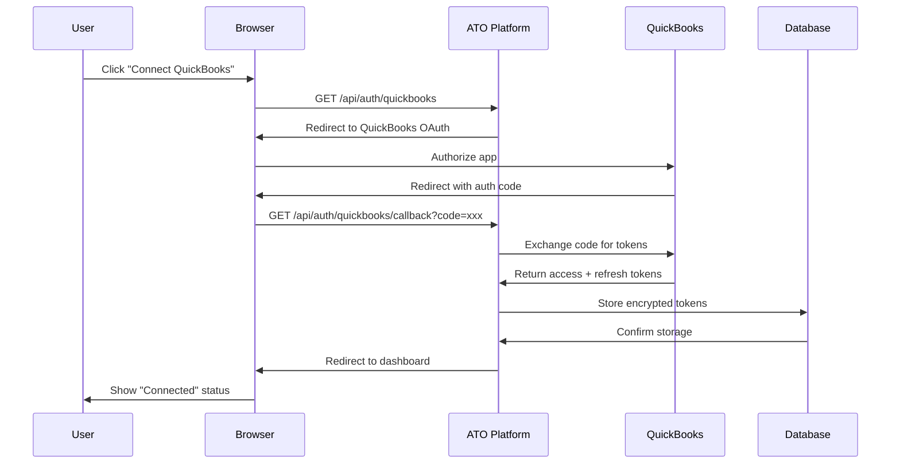
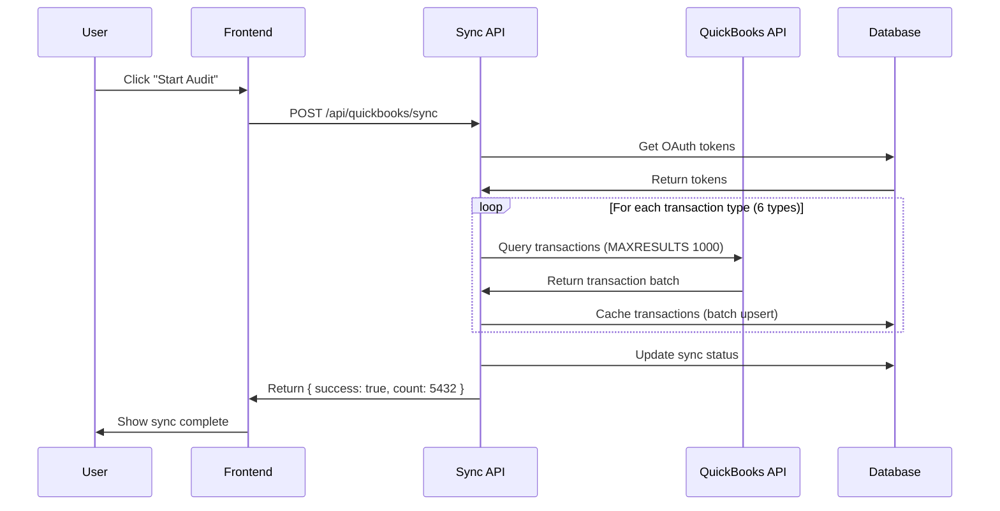
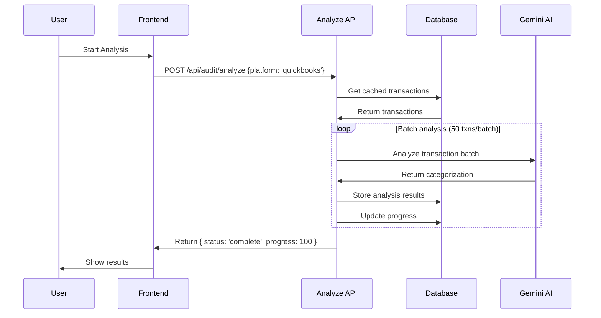

# QuickBooks Online Integration Guide

**Platform**: QuickBooks Online (QBO)
**API Version**: Accounting API v3
**Transaction Coverage**: 100% (6/6 transaction types)
**Status**: Production Ready ✅

---

## 📋 Table of Contents

1. [Overview](#overview)
2. [Architecture](#architecture)
3. [Setup & Configuration](#setup--configuration)
4. [Transaction Types](#transaction-types)
5. [Data Flow](#data-flow)
6. [API Reference](#api-reference)
7. [Testing](#testing)
8. [Troubleshooting](#troubleshooting)
9. [Security](#security)

---

## Overview

The QuickBooks integration enables the Australian Tax Optimizer (ATO) platform to:

- **Fetch 5 years** of historical transaction data
- **Analyze 6 transaction types** (Purchase, Bill, Invoice, Expense, CreditMemo, JournalEntry)
- **Normalize data** to canonical format for AI analysis
- **Cache transactions** for fast retrieval and offline analysis
- **Detect tax opportunities** (R&D Tax Incentive, Division 7A, deductions)

### Market Impact

- **36% market share** in Australian SMB accounting software
- **80,000+ businesses** use QuickBooks Online in Australia
- **Target revenue**: $200K-$500K tax recovery per client

---

## Architecture

### Component Overview

```
┌─────────────────────────────────────────────────────────────────┐
│                     QuickBooks Integration                        │
├─────────────────────────────────────────────────────────────────┤
│                                                                   │
│  OAuth 2.0 Flow                  Transaction Fetching            │
│  ┌──────────────┐                ┌──────────────────┐           │
│  │ quickbooks-  │───────────────>│ quickbooks-      │           │
│  │ config.ts    │                │ client.ts        │           │
│  └──────────────┘                └──────────────────┘           │
│         │                                 │                      │
│         v                                 v                      │
│  ┌──────────────┐                ┌──────────────────┐           │
│  │ OAuth        │                │ Historical       │           │
│  │ Callback     │                │ Fetcher          │           │
│  └──────────────┘                └──────────────────┘           │
│         │                                 │                      │
│         v                                 v                      │
│  ┌──────────────┐                ┌──────────────────┐           │
│  │ Token        │                │ Data             │           │
│  │ Storage      │                │ Normalization    │           │
│  │ (Database)   │                │ (Adapter)        │           │
│  └──────────────┘                └──────────────────┘           │
│                                          │                       │
│                                          v                       │
│                                  ┌──────────────────┐           │
│                                  │ Transaction      │           │
│                                  │ Cache            │           │
│                                  └──────────────────┘           │
│                                          │                       │
│                                          v                       │
│                                  ┌──────────────────┐           │
│                                  │ AI Forensic      │           │
│                                  │ Analysis         │           │
│                                  └──────────────────┘           │
│                                                                   │
└─────────────────────────────────────────────────────────────────┘
```

### File Structure

```
lib/integrations/
├── quickbooks-config.ts              # OAuth configuration
├── quickbooks-client.ts              # API client & token management
├── quickbooks-historical-fetcher.ts  # Transaction fetching & caching
└── quickbooks-adapter.ts             # Data normalization

app/api/
├── auth/quickbooks/
│   ├── route.ts                      # Initiate OAuth
│   ├── callback/route.ts             # OAuth callback handler
│   └── disconnect/route.ts           # Disconnect realm
└── quickbooks/
    └── sync/route.ts                 # Historical data sync

tests/integrations/quickbooks/
└── quickbooks-sandbox.test.ts        # Comprehensive test suite
```

---

## Setup & Configuration

### 1. Create QuickBooks Developer App

1. Visit [QuickBooks Developer Portal](https://developer.intuit.com/app/developer/myapps)
2. Click "Create an app"
3. Select "QuickBooks Online and Payments"
4. Configure app settings:
   - **App Name**: Australian Tax Optimizer
   - **Description**: AI-driven tax forensic analysis platform
   - **Redirect URI**: `https://yourdomain.com/api/auth/quickbooks/callback`
   - **Scopes**: `com.intuit.quickbooks.accounting` (read-only)

5. Note your credentials:
   - **Client ID**: `ABXXXXXXXXXXXXXXXXXXXXXXXXXXXX...`
   - **Client Secret**: `XXXXXXXXXXXXXXXXXXXXXXXXXXXXXXXXX...`

### 2. Environment Variables

Add to `.env.local`:

```bash
# QuickBooks OAuth Credentials
QUICKBOOKS_CLIENT_ID=your_client_id_from_intuit
QUICKBOOKS_CLIENT_SECRET=your_client_secret_from_intuit
QUICKBOOKS_REDIRECT_URI=https://yourdomain.com/api/auth/quickbooks/callback
QUICKBOOKS_ENVIRONMENT=production  # Options: 'sandbox' | 'production'

# For sandbox testing (optional)
QUICKBOOKS_TEST_ENABLED=false
QUICKBOOKS_SANDBOX_REALM_ID=your_test_realm_id
```

### 3. Database Schema

The integration uses the existing `xero_connections` table (supports multi-platform):

```sql
-- No schema changes required!
-- The xero_connections table already supports 'quickbooks' platform
SELECT * FROM xero_connections WHERE tenant_name LIKE '%QuickBooks%';
```

**Cached transactions** stored in:

```sql
SELECT
  platform,
  COUNT(*) as transaction_count,
  MIN(transaction_date) as earliest,
  MAX(transaction_date) as latest
FROM historical_transactions_cache
WHERE platform = 'quickbooks'
GROUP BY platform;
```

---

## Transaction Types

QuickBooks provides 6 transaction types relevant for tax analysis:

### 1. Purchase Transactions

**Purpose**: Vendor payments with immediate settlement
**Tax Relevance**: R&D expenditure, Division 7A loan repayments
**QuickBooks Entity**: `Purchase`

```typescript
// Fetch purchases
const purchases = await fetchQuickBooksPurchases(client, '2020-07-01', '2025-06-30')

// Example structure
{
  Id: '145',
  TxnDate: '2024-08-15',
  TotalAmt: 1500.00,
  DocNumber: 'PO-2024-145',
  VendorRef: { value: '67', name: 'Tech Supplies Co' },
  Line: [...],
  PaymentType: 'CreditCard'
}
```

### 2. Bill Transactions

**Purpose**: Vendor invoices for later payment
**Tax Relevance**: Accrued expenses, prepayments
**QuickBooks Entity**: `Bill`

```typescript
// Fetch bills
const bills = await fetchQuickBooksBills(client, '2020-07-01', '2025-06-30')

// Example structure
{
  Id: '78',
  TxnDate: '2024-09-01',
  TotalAmt: 2500.00,
  VendorRef: { value: '45', name: 'Office Supplies Inc' },
  Line: [...],
  DueDate: '2024-09-30'
}
```

### 3. Invoice Transactions

**Purpose**: Customer billing (revenue tracking)
**Tax Relevance**: Income, GST, revenue recognition
**QuickBooks Entity**: `Invoice`

```typescript
// Fetch invoices
const invoices = await fetchQuickBooksInvoices(client, '2020-07-01', '2025-06-30')

// Example structure
{
  Id: '234',
  TxnDate: '2024-09-15',
  TotalAmt: 5000.00,
  CustomerRef: { value: '89', name: 'Client Corp' },
  Line: [...],
  Balance: 5000.00
}
```

### 4. Expense Transactions ⭐ NEW

**Purpose**: Direct expenses without vendor records
**Tax Relevance**: Section 8-1 deductions, petty cash, travel
**QuickBooks Entity**: `Expense`

```typescript
// Fetch expenses
const expenses = await fetchQuickBooksExpenses(client, '2020-07-01', '2025-06-30')

// Example structure
{
  Id: '456',
  TxnDate: '2024-10-01',
  TotalAmt: 150.00,
  AccountRef: { value: '12', name: 'Travel Expenses' },
  Line: [...],
  PaymentType: 'Cash'
}
```

### 5. Credit Memo Transactions ⭐ NEW

**Purpose**: Customer refunds and credits
**Tax Relevance**: Bad debt recovery (Section 25-35)
**QuickBooks Entity**: `CreditMemo`

```typescript
// Fetch credit memos
const creditMemos = await fetchQuickBooksCreditMemos(client, '2020-07-01', '2025-06-30')

// Example structure
{
  Id: '789',
  TxnDate: '2024-10-10',
  TotalAmt: -500.00,
  CustomerRef: { value: '89', name: 'Client Corp' },
  RemainingCredit: 500.00,
  Line: [...]
}
```

### 6. Journal Entry Transactions ⭐ NEW

**Purpose**: Manual accounting adjustments
**Tax Relevance**: Audit misclassifications, accruals
**QuickBooks Entity**: `JournalEntry`

```typescript
// Fetch journal entries
const journalEntries = await fetchQuickBooksJournalEntries(client, '2020-07-01', '2025-06-30')

// Example structure
{
  Id: '101',
  TxnDate: '2024-10-31',
  TotalAmt: 0, // Balanced entry
  Line: [
    {
      Amount: 1000.00,
      DetailType: 'JournalEntryLineDetail',
      JournalEntryLineDetail: {
        PostingType: 'Debit',
        AccountRef: { value: '50', name: 'Accounts Receivable' }
      }
    },
    {
      Amount: -1000.00,
      DetailType: 'JournalEntryLineDetail',
      JournalEntryLineDetail: {
        PostingType: 'Credit',
        AccountRef: { value: '60', name: 'Revenue' }
      }
    }
  ]
}
```

---

## Data Flow

### OAuth Connection Flow



### Historical Sync Flow



### Analysis Flow



---

## API Reference

### OAuth Endpoints

#### `GET /api/auth/quickbooks`

**Purpose**: Initiate OAuth 2.0 authorization flow

**Query Parameters**:
- None

**Response**: Redirects to QuickBooks OAuth page

**Example**:
```typescript
// Browser automatically redirected
window.location.href = '/api/auth/quickbooks'
```

---

#### `GET /api/auth/quickbooks/callback`

**Purpose**: OAuth callback handler (receives auth code)

**Query Parameters**:
- `code`: string (authorization code from QuickBooks)
- `state`: string (CSRF protection token)
- `realmId`: string (QuickBooks company ID)

**Response**: Redirects to dashboard with success/error status

**Implementation**: Exchanges code for access token, stores in database

---

#### `POST /api/auth/quickbooks/disconnect`

**Purpose**: Disconnect QuickBooks realm

**Body**:
```json
{
  "tenantId": "string" // QuickBooks realm ID
}
```

**Response**:
```json
{
  "success": true,
  "message": "QuickBooks connection removed"
}
```

---

### Sync Endpoints

#### `POST /api/quickbooks/sync`

**Purpose**: Fetch and cache historical transaction data

**Body** (optional):
```json
{
  "startDate": "2020-07-01",  // YYYY-MM-DD format
  "endDate": "2025-06-30"     // YYYY-MM-DD format
}
```

**Response**:
```json
{
  "success": true,
  "transactionsSynced": 5432,
  "message": "Successfully synced 5432 QuickBooks transactions"
}
```

**Behavior**:
- Fetches all 6 transaction types by default
- Batch upserts to database (500 transactions per chunk)
- Updates `audit_sync_status` table
- Handles rate limiting (500 req/min)

---

### Analysis Endpoints

#### `POST /api/audit/analyze`

**Purpose**: Start AI forensic analysis of cached transactions

**Body**:
```json
{
  "tenantId": "string",
  "platform": "quickbooks",
  "batchSize": 50  // Optional, default: 50
}
```

**Response**:
```json
{
  "status": "analyzing",
  "progress": 0,
  "transactionsAnalyzed": 0,
  "totalTransactions": 5432,
  "estimatedCostUSD": 2.45,
  "message": "Started AI analysis...",
  "pollUrl": "/api/audit/analysis-status/{tenantId}"
}
```

---

## Testing

### Sandbox Testing

1. **Create QuickBooks Sandbox Company**:
   - Go to https://developer.intuit.com/app/developer/sandbox
   - Create test company
   - Note the `realmId`

2. **Set Environment Variables**:
   ```bash
   QUICKBOOKS_TEST_ENABLED=true
   QUICKBOOKS_SANDBOX_REALM_ID=your_realm_id
   QUICKBOOKS_ENVIRONMENT=sandbox
   ```

3. **Run Test Suite**:
   ```bash
   # Run all QuickBooks tests
   npm test -- tests/integrations/quickbooks

   # Run specific test
   npm test -- tests/integrations/quickbooks/quickbooks-sandbox.test.ts
   ```

### Test Coverage

The test suite (`quickbooks-sandbox.test.ts`) covers:

- ✅ OAuth 2.0 authorization URL generation
- ✅ OAuth state parameter validation
- ✅ Token storage structure
- ✅ Token expiration detection
- ✅ Token refresh logic
- ✅ All 6 transaction types (Purchase, Bill, Invoice, Expense, CreditMemo, JournalEntry)
- ✅ Data normalization for each type
- ✅ Australian financial year calculation
- ✅ Error handling (401 Unauthorized, 429 Rate Limit, 400 Bad Request)
- ✅ Rate limiting compliance

### Manual Testing Checklist

```bash
# 1. Test OAuth flow
curl http://localhost:3000/api/auth/quickbooks
# Expected: Redirect to QuickBooks login

# 2. Test sync endpoint (after OAuth)
curl -X POST http://localhost:3000/api/quickbooks/sync \
  -H "Content-Type: application/json" \
  -d '{"startDate": "2024-01-01", "endDate": "2024-12-31"}'
# Expected: {"success": true, "transactionsSynced": 1234}

# 3. Verify cached data
psql $DATABASE_URL -c "SELECT platform, COUNT(*) FROM historical_transactions_cache WHERE platform='quickbooks' GROUP BY platform;"
# Expected: quickbooks | 1234

# 4. Test analysis endpoint
curl -X POST http://localhost:3000/api/audit/analyze \
  -H "Content-Type: application/json" \
  -d '{"tenantId": "your_realm_id", "platform": "quickbooks"}'
# Expected: {"status": "analyzing", "progress": 0, ...}
```

---

## Troubleshooting

### Common Issues

#### 1. OAuth Callback Fails

**Error**: "Invalid redirect URI"

**Cause**: Redirect URI in QuickBooks Developer Portal doesn't match `QUICKBOOKS_REDIRECT_URI`

**Fix**:
- Verify environment variable matches exactly: `https://yourdomain.com/api/auth/quickbooks/callback`
- Check for trailing slashes
- Ensure HTTPS in production (HTTP only allowed in local development)

---

#### 2. Token Refresh Fails

**Error**: "Token expired and refresh failed"

**Cause**: Refresh token expired (after 100 days) or invalid

**Fix**:
- User must re-authenticate via OAuth
- Implement proactive token refresh (refresh when expires_at < now + 5 minutes)
- Check `isQuickBooksTokenExpired()` function

---

#### 3. Rate Limit Errors

**Error**: "429 Too Many Requests"

**Cause**: Exceeded QuickBooks API limit (500 requests/minute)

**Fix**:
- Implement exponential backoff
- Add delays between batch requests
- Use MAXRESULTS 1000 to minimize API calls

---

#### 4. No Transactions Found

**Error**: "No cached transactions found"

**Cause**: Historical sync not completed or failed

**Fix**:
1. Check sync status:
   ```sql
   SELECT * FROM audit_sync_status WHERE platform='quickbooks';
   ```
2. Check for errors in sync_status table
3. Re-run sync: `POST /api/quickbooks/sync`
4. Verify OAuth token is valid

---

#### 5. Transaction Type Not Recognized

**Error**: Unknown transaction type in normalization

**Cause**: `determineTransactionType()` function doesn't handle new structure

**Fix**:
- Check `rawData.domain` field
- Add new case to `determineTransactionType()` in `quickbooks-adapter.ts`
- Log full transaction structure for debugging

---

## Security

### Token Storage

**Access Tokens**:
- Stored encrypted in database (`xero_connections` table)
- Expire after 1 hour
- Automatically refreshed using refresh token

**Refresh Tokens**:
- Valid for 100 days
- Stored encrypted alongside access token
- Must be rotated upon use (QuickBooks rotates refresh tokens)

**Database Schema**:
```sql
CREATE TABLE xero_connections (
  tenant_id TEXT PRIMARY KEY,
  user_id UUID REFERENCES auth.users(id),
  access_token TEXT NOT NULL,        -- Encrypted
  refresh_token TEXT NOT NULL,       -- Encrypted
  expires_at BIGINT NOT NULL,
  realm_id TEXT NOT NULL,
  tenant_name TEXT,
  organisation_name TEXT,
  created_at TIMESTAMP DEFAULT NOW(),
  updated_at TIMESTAMP DEFAULT NOW()
);

-- Tenant isolation (RLS policy)
ALTER TABLE xero_connections ENABLE ROW LEVEL SECURITY;

CREATE POLICY "Users can only access their own connections"
ON xero_connections FOR ALL
TO authenticated
USING (user_id = auth.uid());
```

### OAuth Security

- **CSRF Protection**: State parameter validated on callback
- **HTTPS Required**: Production OAuth requires HTTPS
- **Read-Only Scopes**: Only `com.intuit.quickbooks.accounting` scope (read-only)
- **Token Rotation**: Refresh tokens rotated on each use

### Data Privacy

- **Tenant Isolation**: RLS policies enforce tenant boundaries
- **No Write Operations**: Integration is read-only (cannot modify QuickBooks data)
- **Audit Logging**: All API calls logged for security auditing
- **Service Role Keys**: Not exposed to client-side code

---

## Rate Limits

### QuickBooks API Limits

| Limit Type | Value | Notes |
|-----------|-------|-------|
| Requests per minute | 500 | Per company (realm_id) |
| Concurrent requests | 10 | Per company |
| Query max results | 1000 | MAXRESULTS parameter |
| Batch size | 30 | For batch operations |

### Implementation Strategy

```typescript
// Respect rate limits with delays
async function fetchAllTransactions() {
  const types = ['Purchase', 'Bill', 'Invoice', 'Expense', 'CreditMemo', 'JournalEntry']

  for (const type of types) {
    const transactions = await fetchTransactions(type)
    // Delay between calls to avoid rate limiting
    await delay(1000) // 1 second between transaction types
  }
}

// Exponential backoff for 429 errors
async function retryWithBackoff(fn, maxAttempts = 3) {
  for (let attempt = 1; attempt <= maxAttempts; attempt++) {
    try {
      return await fn()
    } catch (error) {
      if (error.status === 429 && attempt < maxAttempts) {
        const delayMs = Math.pow(2, attempt) * 1000 // 2s, 4s, 8s
        await delay(delayMs)
        continue
      }
      throw error
    }
  }
}
```

---

## Appendix: Transaction Coverage Comparison

| Platform | Transaction Types | Coverage | Notes |
|----------|------------------|----------|-------|
| **QuickBooks** | 6 types | 100% ✅ | Purchase, Bill, Invoice, Expense, CreditMemo, JournalEntry |
| **Xero** | 5 types | 100% ✅ | Invoice, Bill, BankTransaction, CreditNote, ManualJournal |
| **MYOB** | 4 types | 80% 🔄 | Invoice, Bill, CashPayment, GeneralJournal |

**QuickBooks Advantage**: Most comprehensive transaction type coverage for tax analysis.

---

**Last Updated**: 2026-01-29
**Author**: Claude (UNI-232 Implementation)
**Version**: 2.0.0
