# Accountant Workflow System Diagrams

**Document Version**: 1.1
**Created**: 2026-01-30
**Updated**: 2026-02-11
**Linear Issue**: [UNI-278](https://linear.app/unite-hub/issue/UNI-278)
**ADR**: [ADR-017](../adr/ADR-017-accountant-workflow-integration.md)

---

## Table of Contents

1. [System Architecture](#system-architecture)
2. [Forensic-to-Findings Pipeline](#forensic-to-findings-pipeline)
3. [Component Architecture](#component-architecture)
4. [Data Flow Diagrams](#data-flow-diagrams)
5. [Accountant Vetting Flow](#accountant-vetting-flow)
6. [Sequence Diagrams](#sequence-diagrams)
7. [State Machine Diagrams](#state-machine-diagrams)
8. [Deployment Architecture](#deployment-architecture)

---

## System Architecture

### High-Level System Overview

```mermaid
graph TB
    subgraph "Client Layer"
        WEB[Web Browser]
        MOBILE[Mobile Browser]
    end

    subgraph "Next.js Application (Vercel)"
        APP[Next.js 16 App]
        API[API Routes]
        SSR[Server Components]
    end

    subgraph "Accountant Workflow System"
        DASH[6-Area Dashboard]
        MAPPER[Forensic-to-Findings Mapper]
        VETTING[Accountant Vetting Pipeline]
        CONF[Confidence Scorer]
        LEG[Legislation Linker]
    end

    subgraph "Data Layer"
        XERO[Xero Forensic Analyzer]
        GEMINI[Google Gemini 2.0 Flash]
        DB[(Supabase PostgreSQL)]
    end

    subgraph "External Services"
        XERO_API[Xero API]
        ATO[ATO Legislation DB]
    end

    subgraph "Planned (Phase 2/3)"
        NOTIF[Notification Engine]:::planned
        REPORT[Report Generator]:::planned
    end

    WEB --> APP
    MOBILE --> APP
    APP --> SSR
    APP --> API

    API --> DASH
    API --> MAPPER
    API --> VETTING

    DASH --> CONF
    DASH --> LEG

    MAPPER --> DB
    DASH --> XERO
    XERO --> GEMINI
    XERO --> XERO_API
    GEMINI --> DB

    LEG --> ATO
    CONF --> DB

    classDef planned fill:#374151,stroke:#6b7280,stroke-dasharray: 5 5
    style DASH fill:#3b82f6
    style MAPPER fill:#10b981
    style VETTING fill:#8b5cf6
    style CONF fill:#f59e0b
    style LEG fill:#ec4899
```

---

## Forensic-to-Findings Pipeline

### Pipeline Overview

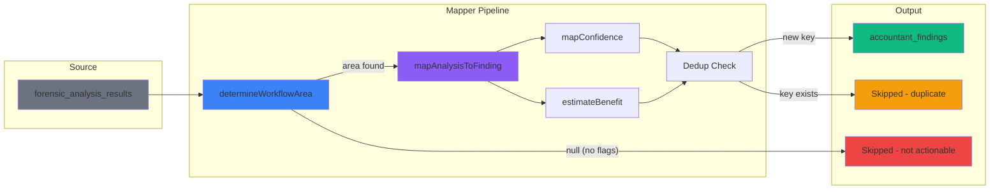

### Priority Routing Decision Tree

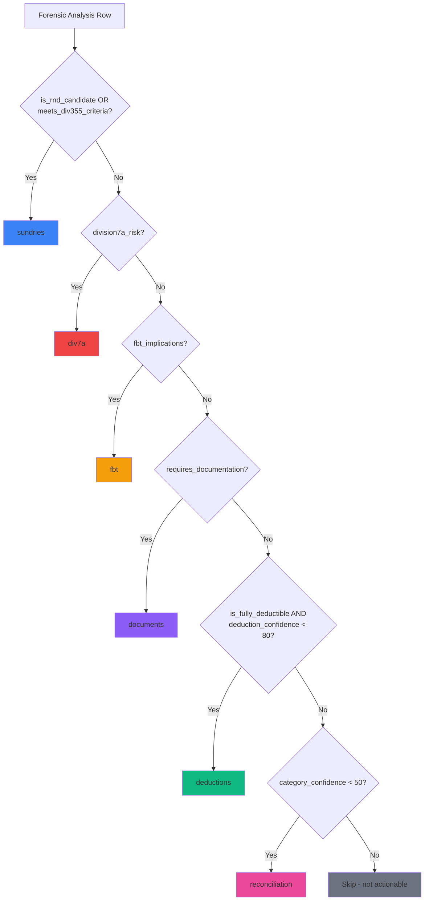

### Confidence Scoring Flow

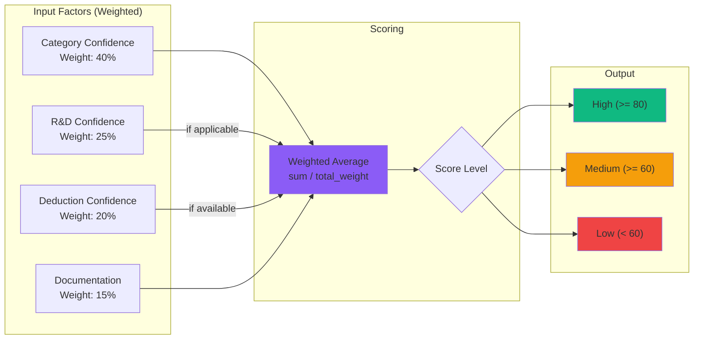

---

## Component Architecture

### 6-Area Dashboard Architecture

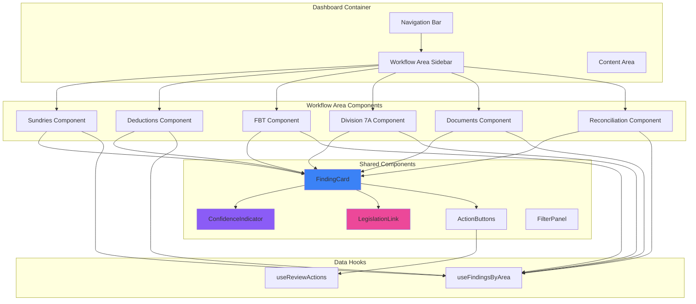

### Notification Engine Architecture (Planned — Phase 2)

```mermaid
graph LR
    subgraph "Trigger Sources"
        INSERT[New Finding Inserted]
        UPDATE[Finding Updated]
        TIMER[Scheduled Job]
    end

    subgraph "Notification Engine"
        EVALUATOR[Priority Evaluator]:::planned
        TEMPLATE[Message Template Engine]:::planned
        DISPATCHER[Notification Dispatcher]:::planned
    end

    subgraph "Delivery Channels"
        IN_APP[In-App Badge]:::planned
        EMAIL[Email Digest]:::planned
        DB_NOTIF[(DB: accountant_notifications)]:::planned
    end

    INSERT --> EVALUATOR
    UPDATE --> EVALUATOR
    TIMER --> EVALUATOR

    EVALUATOR -->|High Value >$50K| TEMPLATE
    EVALUATOR -->|Compliance Risk| TEMPLATE
    EVALUATOR -->|Deadline <30 days| TEMPLATE
    EVALUATOR -->|Critical Anomaly| TEMPLATE

    TEMPLATE --> DISPATCHER

    DISPATCHER --> IN_APP
    DISPATCHER --> EMAIL
    DISPATCHER --> DB_NOTIF

    classDef planned fill:#374151,stroke:#6b7280,stroke-dasharray: 5 5
```

### Report Generator Architecture (Planned — Phase 3)

```mermaid
graph TB
    subgraph "Report Generation Pipeline"
        SELECT[1. Select Findings]:::planned
        CUSTOMIZE[2. Customize Report]:::planned
        PREVIEW[3. Preview]:::planned
        APPROVE[4. Accountant Approval]:::planned
        GENERATE[5. Generate PDF]:::planned
        SEND[6. Email Client]:::planned
    end

    SELECT --> CUSTOMIZE
    CUSTOMIZE --> PREVIEW
    PREVIEW --> APPROVE
    APPROVE --> GENERATE
    GENERATE --> SEND

    classDef planned fill:#374151,stroke:#6b7280,stroke-dasharray: 5 5
```

---

## Data Flow Diagrams

### Forensic-to-Findings Generation Flow

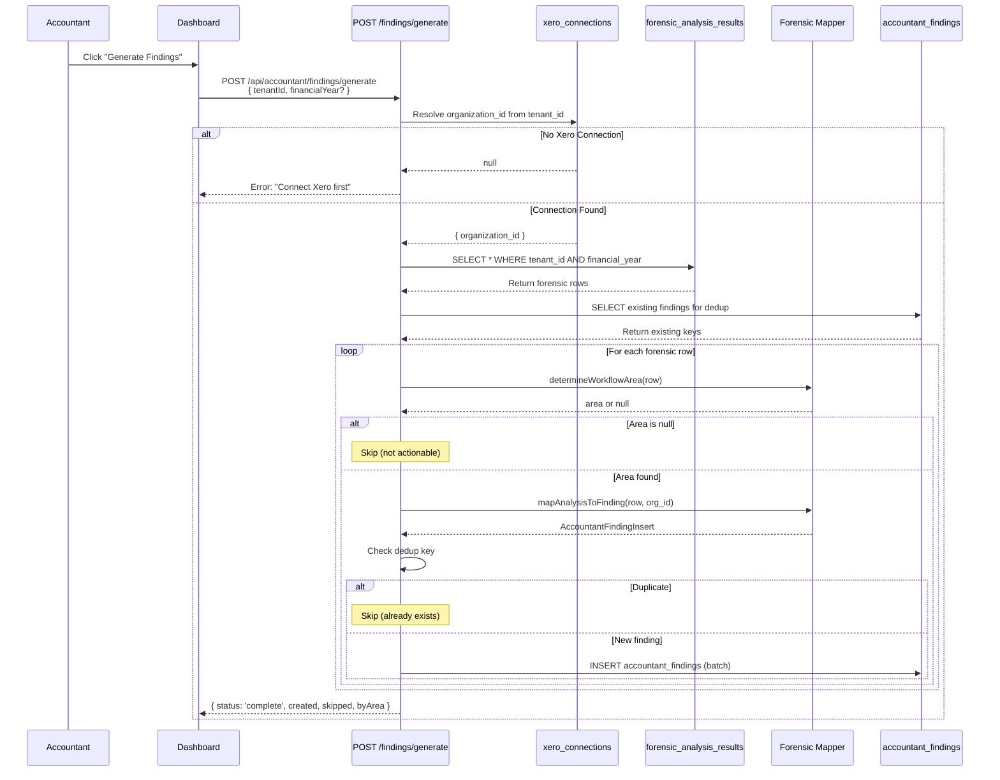

### Finding Review & Approval Flow

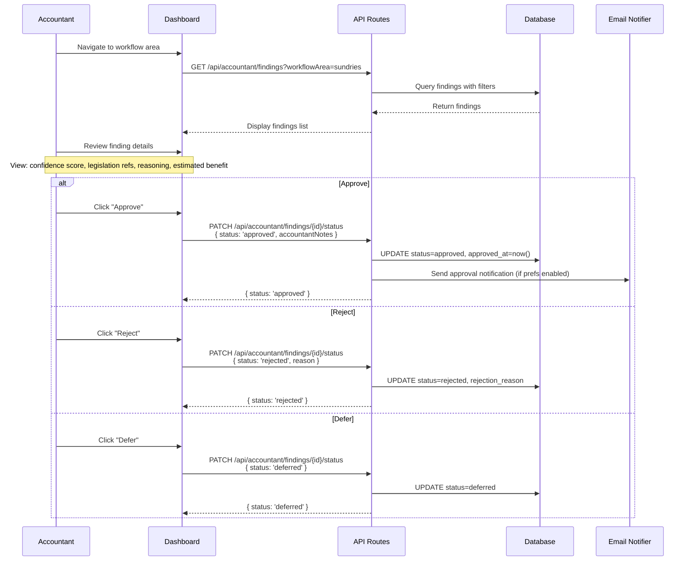

---

## Accountant Vetting Flow

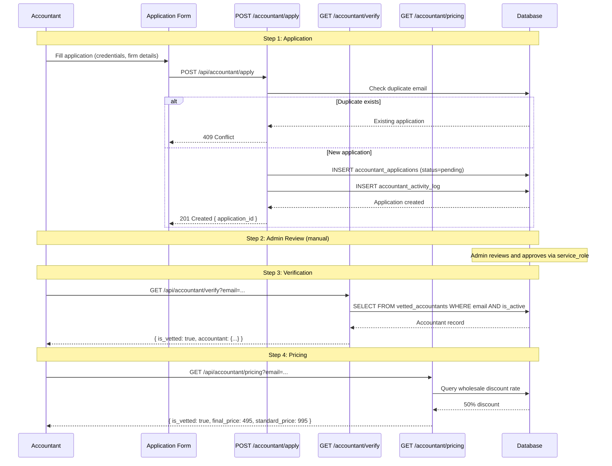

### Vetting State Machine

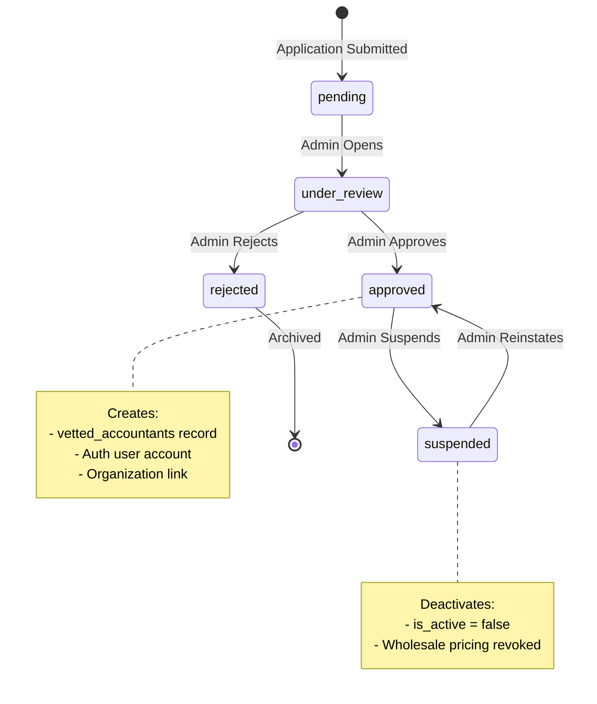

---

## Sequence Diagrams

### Complete End-to-End Flow

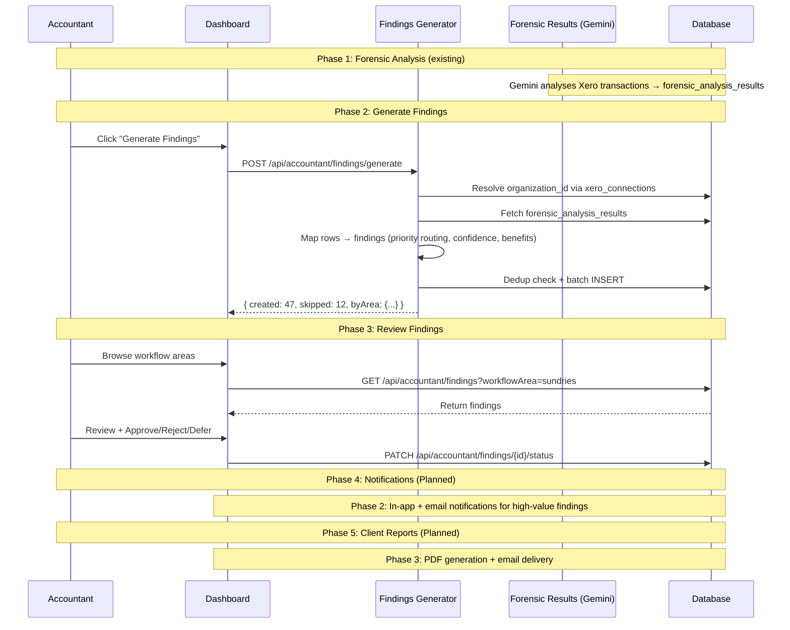

---

## State Machine Diagrams

### Finding Status State Machine

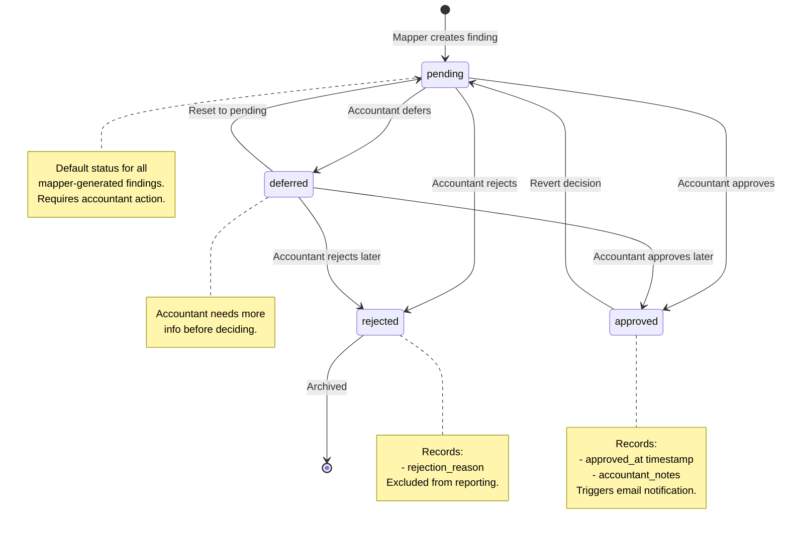

---

## Deployment Architecture

### Production Deployment (Vercel)

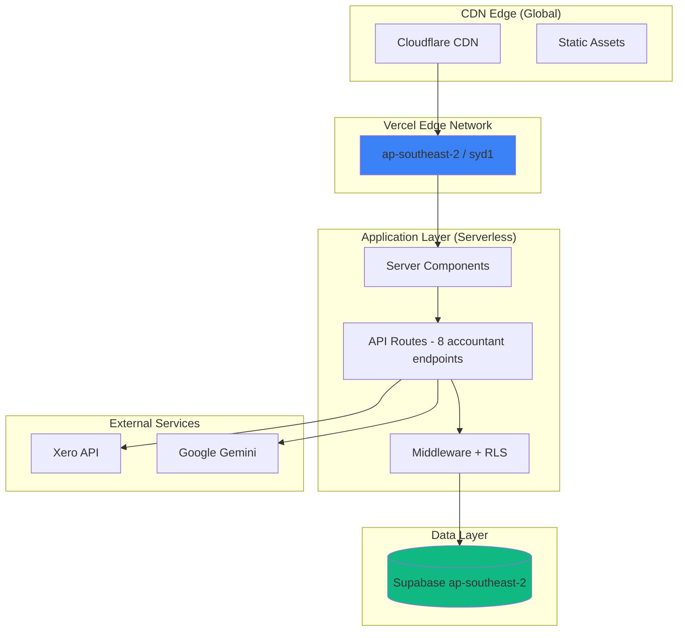

---

## Security Architecture

### RLS Enforcement for Findings

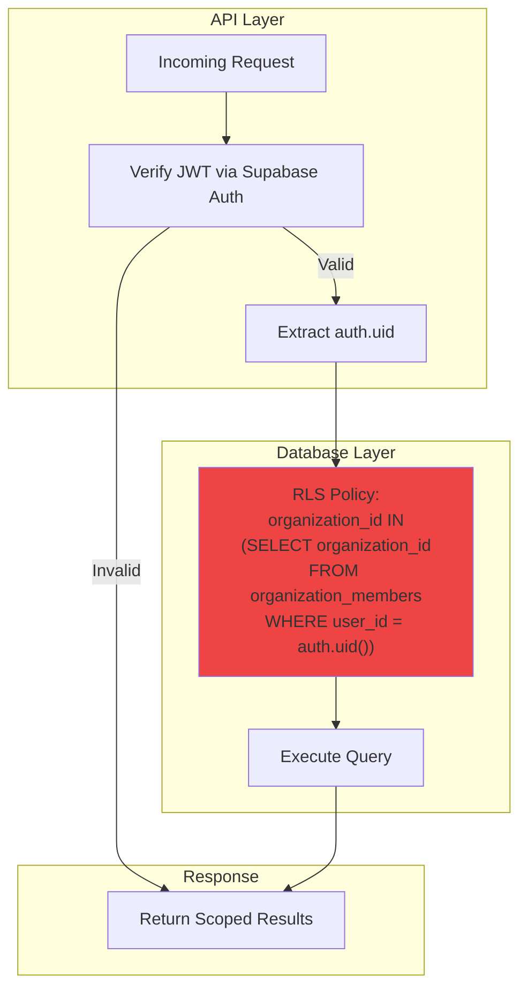

---

**System Diagrams Status**: Updated (v1.1)
**Total Diagrams**: 16
**Key additions**: Forensic-to-Findings Pipeline, Priority Routing Decision Tree, Accountant Vetting Flow
**Changes**: Notification and Report Generator diagrams marked as "Planned (Phase 2/3)"
