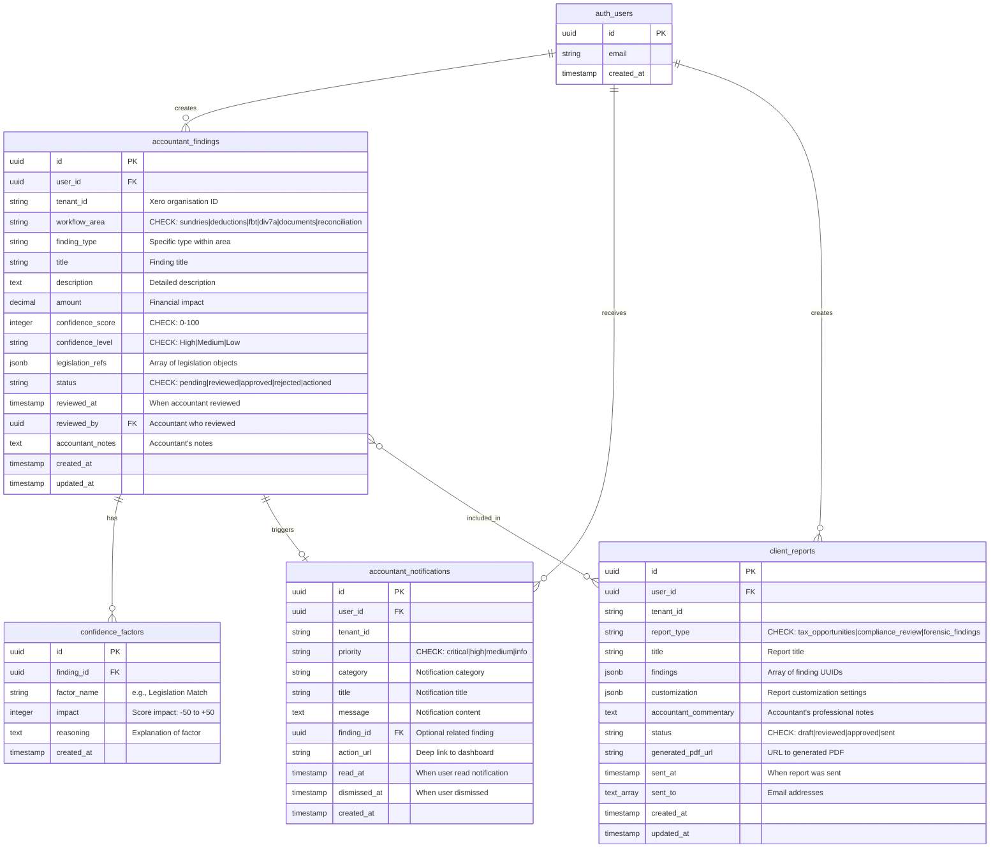
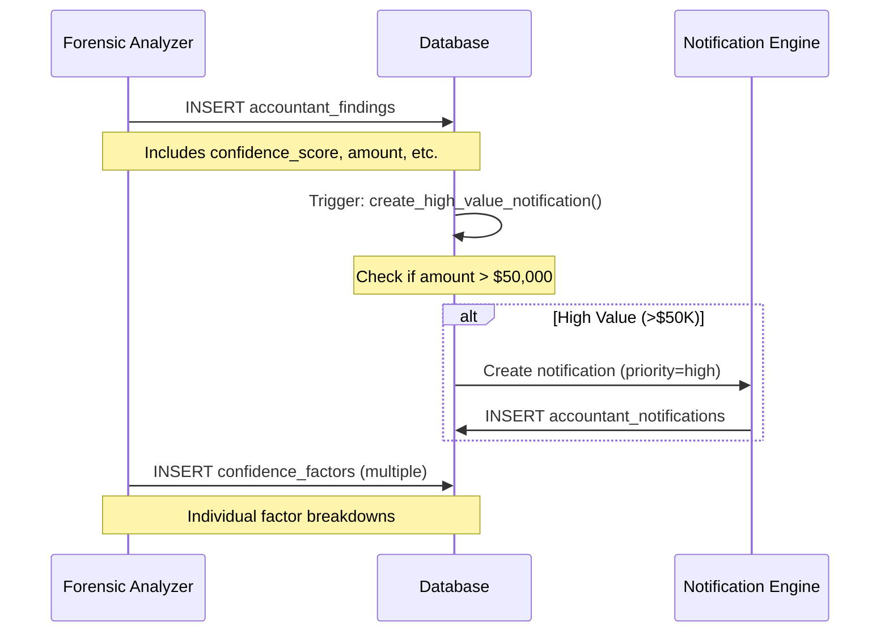
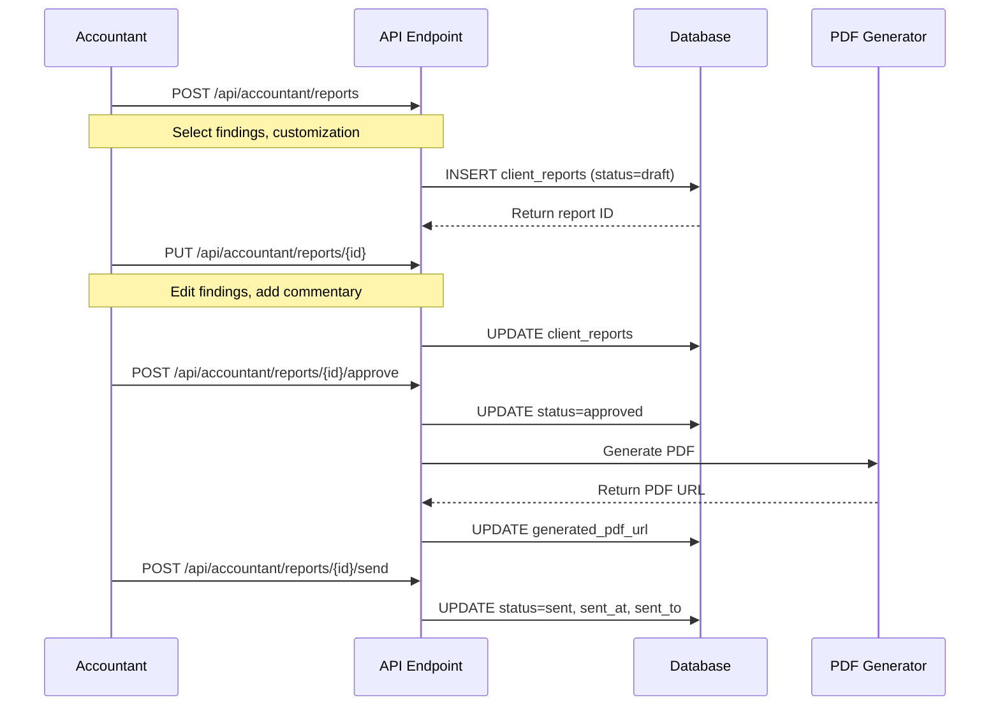

# Accountant Workflow Database ERD

**Document Version**: 1.0
**Created**: 2026-01-30
**Linear Issue**: [UNI-278](https://linear.app/unite-hub/issue/UNI-278)
**ADR**: [ADR-017](../adr/ADR-017-accountant-workflow-integration.md)

---

## Entity Relationship Diagram



---

## Table Specifications

### accountant_findings

**Purpose**: Core findings table storing tax opportunities and compliance issues across 6 workflow areas.

**Primary Key**: `id` (UUID, auto-generated)

**Foreign Keys**:
- `user_id` → `auth.users(id)` - User who owns the finding
- `reviewed_by` → `auth.users(id)` - Accountant who reviewed the finding

**Indexes**:
```sql
CREATE INDEX idx_findings_user_tenant ON accountant_findings(user_id, tenant_id);
CREATE INDEX idx_findings_workflow_area ON accountant_findings(workflow_area);
CREATE INDEX idx_findings_status ON accountant_findings(status);
CREATE INDEX idx_findings_confidence ON accountant_findings(confidence_level, confidence_score DESC);
CREATE INDEX idx_findings_amount ON accountant_findings(amount DESC NULLS LAST);
CREATE INDEX idx_findings_created ON accountant_findings(created_at DESC);
```

**Check Constraints**:
```sql
ALTER TABLE accountant_findings
  ADD CONSTRAINT check_workflow_area
    CHECK (workflow_area IN ('sundries', 'deductions', 'fbt', 'div7a', 'documents', 'reconciliation')),
  ADD CONSTRAINT check_confidence_score
    CHECK (confidence_score >= 0 AND confidence_score <= 100),
  ADD CONSTRAINT check_confidence_level
    CHECK (confidence_level IN ('High', 'Medium', 'Low')),
  ADD CONSTRAINT check_status
    CHECK (status IN ('pending', 'reviewed', 'approved', 'rejected', 'actioned'));
```

**JSONB Structure - legislation_refs**:
```json
[
  {
    "section": "Division 355",
    "act": "ITAA 1997",
    "url": "https://www.ato.gov.au/law/view/document?docid=PAC/19970038/Div355",
    "summary": "R&D Tax Incentive"
  },
  {
    "section": "Section 8-1",
    "act": "ITAA 1997",
    "url": "https://www.ato.gov.au/law/view/document?docid=PAC/19970038/8-1",
    "summary": "General deductions"
  }
]
```

**Row Level Security (RLS)**:
```sql
-- Enable RLS
ALTER TABLE accountant_findings ENABLE ROW LEVEL SECURITY;

-- Policy: Users can only see their own findings
CREATE POLICY "Users can view own findings"
  ON accountant_findings
  FOR SELECT
  USING (auth.uid() = user_id);

-- Policy: Users can insert their own findings
CREATE POLICY "Users can insert own findings"
  ON accountant_findings
  FOR INSERT
  WITH CHECK (auth.uid() = user_id);

-- Policy: Users can update their own findings
CREATE POLICY "Users can update own findings"
  ON accountant_findings
  FOR UPDATE
  USING (auth.uid() = user_id);
```

**Typical Queries**:
```sql
-- Get high-confidence pending findings for a tenant
SELECT
  id,
  workflow_area,
  title,
  amount,
  confidence_score,
  confidence_level
FROM accountant_findings
WHERE user_id = $1
  AND tenant_id = $2
  AND status = 'pending'
  AND confidence_level = 'High'
ORDER BY amount DESC NULLS LAST, confidence_score DESC;

-- Get findings by workflow area with pagination
SELECT *
FROM accountant_findings
WHERE user_id = $1
  AND tenant_id = $2
  AND workflow_area = $3
ORDER BY created_at DESC
LIMIT 50 OFFSET 0;

-- Count findings by status
SELECT
  status,
  COUNT(*) as count,
  SUM(amount) as total_value
FROM accountant_findings
WHERE user_id = $1 AND tenant_id = $2
GROUP BY status;
```

---

### accountant_notifications

**Purpose**: Smart notifications for high-value opportunities and compliance risks.

**Primary Key**: `id` (UUID, auto-generated)

**Foreign Keys**:
- `user_id` → `auth.users(id)` - User receiving notification
- `finding_id` → `accountant_findings(id)` - Related finding (optional)

**Indexes**:
```sql
CREATE INDEX idx_notifications_user_unread
  ON accountant_notifications(user_id)
  WHERE read_at IS NULL;

CREATE INDEX idx_notifications_priority
  ON accountant_notifications(priority, created_at DESC);

CREATE INDEX idx_notifications_finding
  ON accountant_notifications(finding_id)
  WHERE finding_id IS NOT NULL;
```

**Check Constraints**:
```sql
ALTER TABLE accountant_notifications
  ADD CONSTRAINT check_priority
    CHECK (priority IN ('critical', 'high', 'medium', 'info'));
```

**Row Level Security (RLS)**:
```sql
ALTER TABLE accountant_notifications ENABLE ROW LEVEL SECURITY;

CREATE POLICY "Users can view own notifications"
  ON accountant_notifications
  FOR SELECT
  USING (auth.uid() = user_id);

CREATE POLICY "Users can update own notifications"
  ON accountant_notifications
  FOR UPDATE
  USING (auth.uid() = user_id);
```

**Notification Triggers**:
```sql
-- Trigger: Auto-create notification for high-value findings
CREATE OR REPLACE FUNCTION create_high_value_notification()
RETURNS TRIGGER AS $$
BEGIN
  IF NEW.amount > 50000 AND NEW.status = 'pending' THEN
    INSERT INTO accountant_notifications (
      user_id,
      tenant_id,
      priority,
      category,
      title,
      message,
      finding_id,
      action_url
    ) VALUES (
      NEW.user_id,
      NEW.tenant_id,
      'high',
      'high_value_opportunity',
      'High-Value Opportunity Detected',
      format('Potential benefit of $%s identified in %s. Review recommended.',
        NEW.amount::text,
        NEW.workflow_area),
      NEW.id,
      format('/dashboard/accountant/%s?finding=%s', NEW.workflow_area, NEW.id)
    );
  END IF;
  RETURN NEW;
END;
$$ LANGUAGE plpgsql;

CREATE TRIGGER trigger_high_value_notification
  AFTER INSERT ON accountant_findings
  FOR EACH ROW
  EXECUTE FUNCTION create_high_value_notification();
```

**Typical Queries**:
```sql
-- Get unread notifications with count by priority
SELECT
  priority,
  COUNT(*) as count,
  json_agg(json_build_object(
    'id', id,
    'title', title,
    'created_at', created_at
  )) as notifications
FROM accountant_notifications
WHERE user_id = $1
  AND tenant_id = $2
  AND read_at IS NULL
GROUP BY priority
ORDER BY
  CASE priority
    WHEN 'critical' THEN 1
    WHEN 'high' THEN 2
    WHEN 'medium' THEN 3
    WHEN 'info' THEN 4
  END;

-- Mark notification as read
UPDATE accountant_notifications
SET read_at = NOW()
WHERE id = $1 AND user_id = $2;
```

---

### client_reports

**Purpose**: Client-facing reports with customization and approval workflow.

**Primary Key**: `id` (UUID, auto-generated)

**Foreign Keys**:
- `user_id` → `auth.users(id)` - User who created report

**Indexes**:
```sql
CREATE INDEX idx_reports_user_tenant ON client_reports(user_id, tenant_id);
CREATE INDEX idx_reports_status ON client_reports(status);
CREATE INDEX idx_reports_created ON client_reports(created_at DESC);
```

**Check Constraints**:
```sql
ALTER TABLE client_reports
  ADD CONSTRAINT check_report_type
    CHECK (report_type IN ('tax_opportunities', 'compliance_review', 'forensic_findings')),
  ADD CONSTRAINT check_status
    CHECK (status IN ('draft', 'reviewed', 'approved', 'sent'));
```

**JSONB Structure - findings**:
```json
[
  "abc-123-uuid",
  "def-456-uuid",
  "ghi-789-uuid"
]
```

**JSONB Structure - customization**:
```json
{
  "includeSections": [
    "executive_summary",
    "detailed_findings",
    "legislation_references",
    "action_items"
  ],
  "tone": "formal",
  "branding": {
    "logoUrl": "https://example.com/logo.png",
    "primaryColor": "#1E40AF"
  }
}
```

**Row Level Security (RLS)**:
```sql
ALTER TABLE client_reports ENABLE ROW LEVEL SECURITY;

CREATE POLICY "Users can manage own reports"
  ON client_reports
  FOR ALL
  USING (auth.uid() = user_id);
```

**Typical Queries**:
```sql
-- Get report with expanded findings
SELECT
  r.id,
  r.title,
  r.status,
  r.created_at,
  (
    SELECT json_agg(f.*)
    FROM accountant_findings f
    WHERE f.id = ANY(
      SELECT jsonb_array_elements_text(r.findings)::uuid
    )
  ) as findings_detailed
FROM client_reports r
WHERE r.id = $1 AND r.user_id = $2;

-- List reports with finding counts
SELECT
  r.id,
  r.title,
  r.status,
  r.created_at,
  jsonb_array_length(r.findings) as finding_count,
  (
    SELECT SUM(f.amount)
    FROM accountant_findings f
    WHERE f.id = ANY(
      SELECT jsonb_array_elements_text(r.findings)::uuid
    )
  ) as total_value
FROM client_reports r
WHERE r.user_id = $1 AND r.tenant_id = $2
ORDER BY r.created_at DESC;
```

---

### confidence_factors

**Purpose**: Detailed breakdown of confidence score calculation factors.

**Primary Key**: `id` (UUID, auto-generated)

**Foreign Keys**:
- `finding_id` → `accountant_findings(id)` - Parent finding

**Indexes**:
```sql
CREATE INDEX idx_confidence_finding ON confidence_factors(finding_id);
```

**Check Constraints**:
```sql
ALTER TABLE confidence_factors
  ADD CONSTRAINT check_impact_range
    CHECK (impact >= -50 AND impact <= 50);
```

**Row Level Security (RLS)**:
```sql
ALTER TABLE confidence_factors ENABLE ROW LEVEL SECURITY;

-- Inherit from parent finding's RLS
CREATE POLICY "Users can view factors for own findings"
  ON confidence_factors
  FOR SELECT
  USING (
    EXISTS (
      SELECT 1 FROM accountant_findings
      WHERE accountant_findings.id = confidence_factors.finding_id
        AND accountant_findings.user_id = auth.uid()
    )
  );
```

**Typical Queries**:
```sql
-- Get confidence breakdown for a finding
SELECT
  cf.factor_name,
  cf.impact,
  cf.reasoning
FROM confidence_factors cf
WHERE cf.finding_id = $1
ORDER BY ABS(cf.impact) DESC;

-- Calculate total confidence score from factors
SELECT
  finding_id,
  SUM(impact) as calculated_score
FROM confidence_factors
WHERE finding_id = $1
GROUP BY finding_id;
```

---

## Data Flow Diagrams

### Finding Creation Flow



### Report Generation Flow



---

## Cascade Rules

```sql
-- When a finding is deleted, delete associated confidence factors
ALTER TABLE confidence_factors
  ADD CONSTRAINT fk_finding_cascade
  FOREIGN KEY (finding_id)
  REFERENCES accountant_findings(id)
  ON DELETE CASCADE;

-- When a finding is deleted, nullify notification references
ALTER TABLE accountant_notifications
  ADD CONSTRAINT fk_finding_nullify
  FOREIGN KEY (finding_id)
  REFERENCES accountant_findings(id)
  ON DELETE SET NULL;

-- When a user is deleted, delete all their findings
ALTER TABLE accountant_findings
  ADD CONSTRAINT fk_user_cascade
  FOREIGN KEY (user_id)
  REFERENCES auth.users(id)
  ON DELETE CASCADE;
```

---

## Data Retention Policies

```sql
-- Function: Archive old rejected findings (>1 year)
CREATE OR REPLACE FUNCTION archive_old_rejected_findings()
RETURNS void AS $$
BEGIN
  -- Move to archive table (create if needed)
  INSERT INTO accountant_findings_archive
  SELECT * FROM accountant_findings
  WHERE status = 'rejected'
    AND updated_at < NOW() - INTERVAL '1 year';

  -- Delete from active table
  DELETE FROM accountant_findings
  WHERE status = 'rejected'
    AND updated_at < NOW() - INTERVAL '1 year';
END;
$$ LANGUAGE plpgsql;

-- Schedule: Run monthly via pg_cron
SELECT cron.schedule(
  'archive-rejected-findings',
  '0 0 1 * *',  -- First day of month at midnight
  'SELECT archive_old_rejected_findings();'
);
```

---

## Performance Optimization

### Materialized View: Workflow Area Summary

```sql
CREATE MATERIALIZED VIEW accountant_workflow_summary AS
SELECT
  user_id,
  tenant_id,
  workflow_area,
  COUNT(*) as total_findings,
  COUNT(*) FILTER (WHERE status = 'pending') as pending_count,
  COUNT(*) FILTER (WHERE status = 'approved') as approved_count,
  COUNT(*) FILTER (WHERE confidence_level = 'High') as high_confidence_count,
  SUM(amount) as total_value,
  AVG(confidence_score) as avg_confidence_score,
  MAX(created_at) as latest_finding
FROM accountant_findings
GROUP BY user_id, tenant_id, workflow_area;

-- Index for fast lookups
CREATE INDEX idx_workflow_summary_lookup
  ON accountant_workflow_summary(user_id, tenant_id);

-- Refresh strategy: Every 5 minutes
SELECT cron.schedule(
  'refresh-workflow-summary',
  '*/5 * * * *',
  'REFRESH MATERIALIZED VIEW CONCURRENTLY accountant_workflow_summary;'
);
```

### Partitioning Strategy (Future Enhancement)

```sql
-- Partition findings by workflow_area for large datasets
CREATE TABLE accountant_findings_partitioned (
  LIKE accountant_findings INCLUDING ALL
) PARTITION BY LIST (workflow_area);

CREATE TABLE accountant_findings_sundries
  PARTITION OF accountant_findings_partitioned
  FOR VALUES IN ('sundries');

CREATE TABLE accountant_findings_deductions
  PARTITION OF accountant_findings_partitioned
  FOR VALUES IN ('deductions');

-- ... create partitions for other areas
```

---

## Migration Scripts

### Create All Tables

```sql
-- File: migrations/001_accountant_workflow_schema.sql

-- Extension for UUID generation
CREATE EXTENSION IF NOT EXISTS "uuid-ossp";

-- 1. accountant_findings
CREATE TABLE accountant_findings (
    id UUID PRIMARY KEY DEFAULT uuid_generate_v4(),
    user_id UUID NOT NULL REFERENCES auth.users(id) ON DELETE CASCADE,
    tenant_id TEXT NOT NULL,
    workflow_area TEXT NOT NULL CHECK (workflow_area IN (
        'sundries', 'deductions', 'fbt', 'div7a', 'documents', 'reconciliation'
    )),
    finding_type TEXT NOT NULL,
    title TEXT NOT NULL,
    description TEXT NOT NULL,
    amount DECIMAL(15,2),
    confidence_score INTEGER CHECK (confidence_score >= 0 AND confidence_score <= 100),
    confidence_level TEXT CHECK (confidence_level IN ('High', 'Medium', 'Low')),
    legislation_refs JSONB NOT NULL DEFAULT '[]',
    status TEXT NOT NULL DEFAULT 'pending' CHECK (status IN (
        'pending', 'reviewed', 'approved', 'rejected', 'actioned'
    )),
    reviewed_at TIMESTAMPTZ,
    reviewed_by UUID REFERENCES auth.users(id),
    accountant_notes TEXT,
    created_at TIMESTAMPTZ NOT NULL DEFAULT NOW(),
    updated_at TIMESTAMPTZ NOT NULL DEFAULT NOW()
);

-- 2. accountant_notifications
CREATE TABLE accountant_notifications (
    id UUID PRIMARY KEY DEFAULT uuid_generate_v4(),
    user_id UUID NOT NULL REFERENCES auth.users(id) ON DELETE CASCADE,
    tenant_id TEXT NOT NULL,
    priority TEXT NOT NULL CHECK (priority IN ('critical', 'high', 'medium', 'info')),
    category TEXT NOT NULL,
    title TEXT NOT NULL,
    message TEXT NOT NULL,
    finding_id UUID REFERENCES accountant_findings(id) ON DELETE SET NULL,
    action_url TEXT,
    read_at TIMESTAMPTZ,
    dismissed_at TIMESTAMPTZ,
    created_at TIMESTAMPTZ NOT NULL DEFAULT NOW()
);

-- 3. client_reports
CREATE TABLE client_reports (
    id UUID PRIMARY KEY DEFAULT uuid_generate_v4(),
    user_id UUID NOT NULL REFERENCES auth.users(id) ON DELETE CASCADE,
    tenant_id TEXT NOT NULL,
    report_type TEXT NOT NULL DEFAULT 'tax_opportunities' CHECK (report_type IN (
        'tax_opportunities', 'compliance_review', 'forensic_findings'
    )),
    title TEXT NOT NULL,
    findings JSONB NOT NULL DEFAULT '[]',
    customization JSONB NOT NULL DEFAULT '{}',
    accountant_commentary TEXT,
    status TEXT NOT NULL DEFAULT 'draft' CHECK (status IN (
        'draft', 'reviewed', 'approved', 'sent'
    )),
    generated_pdf_url TEXT,
    sent_at TIMESTAMPTZ,
    sent_to TEXT[],
    created_at TIMESTAMPTZ NOT NULL DEFAULT NOW(),
    updated_at TIMESTAMPTZ NOT NULL DEFAULT NOW()
);

-- 4. confidence_factors
CREATE TABLE confidence_factors (
    id UUID PRIMARY KEY DEFAULT uuid_generate_v4(),
    finding_id UUID NOT NULL REFERENCES accountant_findings(id) ON DELETE CASCADE,
    factor_name TEXT NOT NULL,
    impact INTEGER NOT NULL CHECK (impact >= -50 AND impact <= 50),
    reasoning TEXT NOT NULL,
    created_at TIMESTAMPTZ NOT NULL DEFAULT NOW()
);

-- Create indexes
CREATE INDEX idx_findings_user_tenant ON accountant_findings(user_id, tenant_id);
CREATE INDEX idx_findings_workflow_area ON accountant_findings(workflow_area);
CREATE INDEX idx_findings_status ON accountant_findings(status);
CREATE INDEX idx_findings_confidence ON accountant_findings(confidence_level, confidence_score DESC);
CREATE INDEX idx_findings_amount ON accountant_findings(amount DESC NULLS LAST);
CREATE INDEX idx_findings_created ON accountant_findings(created_at DESC);

CREATE INDEX idx_notifications_user_unread ON accountant_notifications(user_id) WHERE read_at IS NULL;
CREATE INDEX idx_notifications_priority ON accountant_notifications(priority, created_at DESC);
CREATE INDEX idx_notifications_finding ON accountant_notifications(finding_id) WHERE finding_id IS NOT NULL;

CREATE INDEX idx_reports_user_tenant ON client_reports(user_id, tenant_id);
CREATE INDEX idx_reports_status ON client_reports(status);
CREATE INDEX idx_reports_created ON client_reports(created_at DESC);

CREATE INDEX idx_confidence_finding ON confidence_factors(finding_id);

-- Enable RLS
ALTER TABLE accountant_findings ENABLE ROW LEVEL SECURITY;
ALTER TABLE accountant_notifications ENABLE ROW LEVEL SECURITY;
ALTER TABLE client_reports ENABLE ROW LEVEL SECURITY;
ALTER TABLE confidence_factors ENABLE ROW LEVEL SECURITY;

-- RLS Policies
CREATE POLICY "Users can view own findings" ON accountant_findings
  FOR SELECT USING (auth.uid() = user_id);

CREATE POLICY "Users can insert own findings" ON accountant_findings
  FOR INSERT WITH CHECK (auth.uid() = user_id);

CREATE POLICY "Users can update own findings" ON accountant_findings
  FOR UPDATE USING (auth.uid() = user_id);

CREATE POLICY "Users can view own notifications" ON accountant_notifications
  FOR SELECT USING (auth.uid() = user_id);

CREATE POLICY "Users can update own notifications" ON accountant_notifications
  FOR UPDATE USING (auth.uid() = user_id);

CREATE POLICY "Users can manage own reports" ON client_reports
  FOR ALL USING (auth.uid() = user_id);

CREATE POLICY "Users can view factors for own findings" ON confidence_factors
  FOR SELECT USING (
    EXISTS (
      SELECT 1 FROM accountant_findings
      WHERE accountant_findings.id = confidence_factors.finding_id
        AND accountant_findings.user_id = auth.uid()
    )
  );

-- Triggers
CREATE OR REPLACE FUNCTION update_updated_at()
RETURNS TRIGGER AS $$
BEGIN
  NEW.updated_at = NOW();
  RETURN NEW;
END;
$$ LANGUAGE plpgsql;

CREATE TRIGGER trigger_findings_updated_at
  BEFORE UPDATE ON accountant_findings
  FOR EACH ROW
  EXECUTE FUNCTION update_updated_at();

CREATE TRIGGER trigger_reports_updated_at
  BEFORE UPDATE ON client_reports
  FOR EACH ROW
  EXECUTE FUNCTION update_updated_at();

-- High-value notification trigger
CREATE OR REPLACE FUNCTION create_high_value_notification()
RETURNS TRIGGER AS $$
BEGIN
  IF NEW.amount > 50000 AND NEW.status = 'pending' THEN
    INSERT INTO accountant_notifications (
      user_id, tenant_id, priority, category, title, message, finding_id, action_url
    ) VALUES (
      NEW.user_id,
      NEW.tenant_id,
      'high',
      'high_value_opportunity',
      'High-Value Opportunity Detected',
      format('Potential benefit of $%s identified in %s. Review recommended.',
        NEW.amount::text, NEW.workflow_area),
      NEW.id,
      format('/dashboard/accountant/%s?finding=%s', NEW.workflow_area, NEW.id)
    );
  END IF;
  RETURN NEW;
END;
$$ LANGUAGE plpgsql;

CREATE TRIGGER trigger_high_value_notification
  AFTER INSERT ON accountant_findings
  FOR EACH ROW
  EXECUTE FUNCTION create_high_value_notification();
```

---

## Sample Data (Development Only)

```sql
-- Insert test finding
INSERT INTO accountant_findings (
  user_id,
  tenant_id,
  workflow_area,
  finding_type,
  title,
  description,
  amount,
  confidence_score,
  confidence_level,
  legislation_refs,
  status
) VALUES (
  (SELECT id FROM auth.users LIMIT 1),
  'test-tenant-123',
  'sundries',
  'rnd_eligible_expense',
  'R&D Eligible Software Development Costs',
  'Software development activities meet Division 355 four-element test. Eligible for 43.5% R&D tax offset.',
  87500.00,
  85,
  'High',
  '[
    {
      "section": "Division 355",
      "act": "ITAA 1997",
      "url": "https://www.ato.gov.au/law/view/document?docid=PAC/19970038/Div355",
      "summary": "R&D Tax Incentive"
    }
  ]'::jsonb,
  'pending'
) RETURNING id;

-- Insert confidence factors for above finding
INSERT INTO confidence_factors (finding_id, factor_name, impact, reasoning) VALUES
  ((SELECT id FROM accountant_findings WHERE title = 'R&D Eligible Software Development Costs'),
   'Legislation Match', 50, 'Direct match to Division 355 ITAA 1997'),
  ((SELECT id FROM accountant_findings WHERE title = 'R&D Eligible Software Development Costs'),
   'Documentation Quality', 20, 'Excellent supporting documentation including timesheets and technical specs'),
  ((SELECT id FROM accountant_findings WHERE title = 'R&D Eligible Software Development Costs'),
   'Precedent Cases', 30, 'Similar software R&D claims approved by ATO'),
  ((SELECT id FROM accountant_findings WHERE title = 'R&D Eligible Software Development Costs'),
   'Amount Threshold', -10, 'Claim amount >$50K may trigger closer scrutiny'),
  ((SELECT id FROM accountant_findings WHERE title = 'R&D Eligible Software Development Costs'),
   'Complexity', -5, 'Straightforward application of four-element test');
```

---

**ERD Status**: Complete
**Total Tables**: 4
**Total Indexes**: 13
**RLS Policies**: 7
**Triggers**: 3
**Next**: System diagrams (deliverable 4 of 5)
