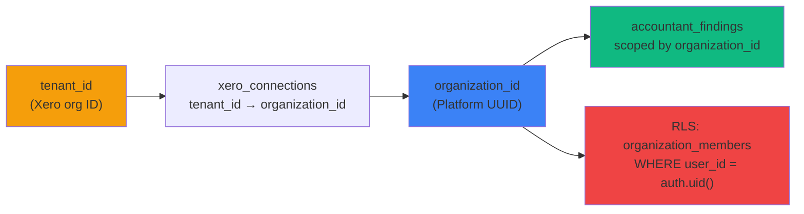

# Accountant Workflow Database ERD

**Document Version**: 1.1
**Created**: 2026-01-30
**Updated**: 2026-02-11
**Linear Issue**: [UNI-278](https://linear.app/unite-hub/issue/UNI-278)
**ADR**: [ADR-017](../adr/ADR-017-accountant-workflow-integration.md)

---

## Entity Relationship Diagram

```mermaid
erDiagram
    auth_users ||--o{ accountant_findings : creates
    organizations ||--o{ accountant_findings : scopes
    forensic_analysis_results ||--o{ accountant_findings : maps_to
    xero_connections ||--|| organizations : "tenant_id → organization_id"

    auth_users ||--o{ accountant_applications : submits
    accountant_applications ||--o| vetted_accountants : approves_to
    auth_users ||--o| vetted_accountants : is_vetted

    accountant_findings }o--o{ client_reports : "included_in (Planned)"

    auth_users {
        uuid id PK
        string email
        timestamp created_at
    }

    organizations {
        uuid id PK
        string name
        timestamp created_at
    }

    xero_connections {
        uuid id PK
        text tenant_id "Xero organisation ID"
        uuid organization_id FK "Links tenant_id to organizations"
        timestamp created_at
    }

    forensic_analysis_results {
        uuid id PK
        uuid tenant_id "Xero org ID"
        text transaction_id "Unique per tenant"
        text financial_year "e.g. FY2024-25"
        text primary_category
        jsonb secondary_categories
        decimal category_confidence "0-100"
        boolean is_rnd_candidate
        boolean meets_div355_criteria
        text rnd_activity_type
        decimal rnd_confidence "0-100"
        text rnd_reasoning
        boolean div355_outcome_unknown
        boolean div355_systematic_approach
        boolean div355_new_knowledge
        boolean div355_scientific_method
        boolean is_fully_deductible
        text deduction_type
        decimal claimable_amount
        jsonb deduction_restrictions
        decimal deduction_confidence "0-100"
        boolean requires_documentation
        boolean fbt_implications
        boolean division7a_risk
        jsonb compliance_notes
        decimal transaction_amount
        text transaction_date
        text transaction_description
        text supplier_name
        timestamptz analyzed_at
    }

    accountant_findings {
        uuid id PK
        uuid user_id FK "auth.users(id)"
        uuid organization_id FK "organizations(id)"
        enum workflow_area "sundries|deductions|fbt|div7a|documents|reconciliation"
        enum status "pending|approved|rejected|deferred"
        text transaction_id "Source transaction"
        date transaction_date
        text description
        decimal amount "15,2"
        text current_classification
        text suggested_classification
        text suggested_action
        integer confidence_score "0-100"
        enum confidence_level "High|Medium|Low"
        jsonb confidence_factors "Array of factor objects"
        jsonb legislation_refs "Array of legislation objects"
        text reasoning "AI-generated explanation"
        text financial_year "e.g. FY2024-25"
        decimal estimated_benefit "15,2"
        text rejection_reason
        text accountant_notes
        timestamptz approved_at
        timestamptz created_at
        timestamptz updated_at
    }

    accountant_applications {
        uuid id PK
        text email UK
        text first_name
        text last_name
        text phone
        text firm_name
        text firm_abn
        text firm_website
        text firm_address
        enum credential_type "CPA|CA|RTA|BAS_AGENT|FTA|OTHER"
        text credential_number
        text credential_issuing_body
        date credential_expiry
        integer years_experience
        text_array specializations
        integer client_count
        text referral_source
        enum status "pending|under_review|approved|rejected|suspended"
        uuid reviewed_by FK
        timestamptz reviewed_at
        text rejection_reason
        text internal_notes
        uuid user_id FK
        uuid approved_organization_id
        jsonb application_data
        text ip_address
        text user_agent
        timestamptz created_at
        timestamptz updated_at
    }

    vetted_accountants {
        uuid id PK
        uuid user_id FK UK "auth.users(id)"
        uuid application_id FK "accountant_applications(id)"
        uuid organization_id
        text email UK
        text full_name
        text firm_name
        text credential_type
        text credential_number
        boolean is_active "Default true"
        timestamptz suspended_at
        text suspension_reason
        uuid suspended_by FK
        numeric wholesale_discount_rate "Default 0.50"
        boolean lifetime_discount "Default true"
        text special_pricing_note
        timestamptz last_login_at
        integer total_reports_generated
        integer total_clients_onboarded
        timestamptz created_at
        timestamptz updated_at
    }

    accountant_activity_log {
        uuid id PK
        uuid accountant_id FK "vetted_accountants(id)"
        uuid application_id FK "accountant_applications(id)"
        text action "e.g. application_submitted"
        uuid actor_id FK "auth.users(id)"
        text actor_role "admin|system|self"
        jsonb details
        text ip_address
        text user_agent
        timestamptz created_at
    }

    accountant_notifications {
        uuid id PK
        uuid user_id FK
        text tenant_id
        enum priority "critical|high|medium|info"
        text category
        text title
        text message
        uuid finding_id FK
        text action_url
        timestamptz read_at
        timestamptz dismissed_at
        timestamptz created_at
    }

    client_reports {
        uuid id PK
        uuid user_id FK
        text tenant_id
        text report_type
        text title
        jsonb findings
        jsonb customization
        text accountant_commentary
        enum status "draft|reviewed|approved|sent"
        text generated_pdf_url
        timestamptz sent_at
        text_array sent_to
        timestamptz created_at
        timestamptz updated_at
    }
```

**Note**: `accountant_notifications` and `client_reports` are shown with dashed relationships as they are **Planned** (Phase 2 and Phase 3 respectively) and do not yet have implemented migrations.

---

## Table Specifications

### accountant_findings (Implemented)

**Source migration**: `supabase/migrations/20260130000000_create_accountant_findings.sql`

**Purpose**: Core findings table storing AI-generated tax opportunities and compliance issues across 6 workflow areas.

**Primary Key**: `id` (UUID, `gen_random_uuid()`)

**Foreign Keys**:
- `user_id` → `auth.users(id)` ON DELETE CASCADE
- `organization_id` → `organizations(id)` ON DELETE CASCADE

**Enum Types**:
```sql
CREATE TYPE workflow_area_type AS ENUM (
  'sundries', 'deductions', 'fbt', 'div7a', 'documents', 'reconciliation'
);

CREATE TYPE confidence_level_type AS ENUM ('High', 'Medium', 'Low');

CREATE TYPE finding_status_type AS ENUM ('pending', 'approved', 'rejected', 'deferred');
```

**Indexes**:
```sql
CREATE INDEX idx_accountant_findings_workflow_area ON accountant_findings(workflow_area);
CREATE INDEX idx_accountant_findings_status ON accountant_findings(status);
CREATE INDEX idx_accountant_findings_confidence_level ON accountant_findings(confidence_level);
CREATE INDEX idx_accountant_findings_financial_year ON accountant_findings(financial_year);
CREATE INDEX idx_accountant_findings_estimated_benefit ON accountant_findings(estimated_benefit DESC);
CREATE INDEX idx_accountant_findings_created_at ON accountant_findings(created_at DESC);
CREATE INDEX idx_accountant_findings_user_id ON accountant_findings(user_id);
CREATE INDEX idx_accountant_findings_organization_id ON accountant_findings(organization_id);
CREATE INDEX idx_accountant_findings_workflow_status ON accountant_findings(workflow_area, status);
CREATE INDEX idx_accountant_findings_org_workflow ON accountant_findings(organization_id, workflow_area);
```

**JSONB Structure — confidence_factors**:
```json
[
  {
    "factor": "Category classification confidence: 85%",
    "impact": "positive",
    "weight": 0.4
  },
  {
    "factor": "Missing source documentation",
    "impact": "negative",
    "weight": 0.15
  }
]
```

**JSONB Structure — legislation_refs**:
```json
[
  {
    "section": "Division 355",
    "act": "ITAA 1997",
    "relevance": "R&D Tax Incentive eligibility and offset calculation"
  },
  {
    "section": "s 355-25",
    "act": "ITAA 1997",
    "relevance": "Core R&D activities definition"
  }
]
```

**Row Level Security (RLS)**:
```sql
ALTER TABLE accountant_findings ENABLE ROW LEVEL SECURITY;

-- Users can view/insert/update/delete findings for their organization
CREATE POLICY "Users can view organization findings"
  ON accountant_findings FOR SELECT
  USING (organization_id IN (
    SELECT organization_id FROM organization_members WHERE user_id = auth.uid()
  ));

CREATE POLICY "Users can create organization findings"
  ON accountant_findings FOR INSERT
  WITH CHECK (organization_id IN (
    SELECT organization_id FROM organization_members WHERE user_id = auth.uid()
  ));

CREATE POLICY "Users can update organization findings"
  ON accountant_findings FOR UPDATE
  USING (organization_id IN (
    SELECT organization_id FROM organization_members WHERE user_id = auth.uid()
  ));

CREATE POLICY "Users can delete organization findings"
  ON accountant_findings FOR DELETE
  USING (organization_id IN (
    SELECT organization_id FROM organization_members WHERE user_id = auth.uid()
  ));
```

---

### forensic_analysis_results (Implemented)

**Source migration**: `supabase/migrations/20260124_forensic_analysis_complete.sql`

**Purpose**: Stores AI forensic analysis output from Gemini. Source table for the forensic-to-findings mapper.

**Primary Key**: `id` (UUID, `gen_random_uuid()`)

**Unique Constraint**: `(tenant_id, transaction_id)`

**Key columns used by mapper**:
- `tenant_id`, `transaction_id`, `financial_year` — identification
- `is_rnd_candidate`, `meets_div355_criteria` — R&D routing
- `division7a_risk` — Div7A routing
- `fbt_implications` — FBT routing
- `requires_documentation` — Documents routing
- `is_fully_deductible`, `deduction_confidence` — Deductions routing
- `category_confidence` — Reconciliation routing
- `rnd_confidence`, `deduction_confidence`, `category_confidence` — Confidence scoring
- `transaction_amount`, `claimable_amount` — Benefit estimation

---

### xero_connections (Existing)

**Purpose**: Links Xero `tenant_id` to platform `organization_id`. Used by the findings generator to resolve which organisation a set of forensic results belongs to.

**Key relationship**: `forensic_analysis_results.tenant_id` → `xero_connections.tenant_id` → `xero_connections.organization_id` → `accountant_findings.organization_id`

---

### accountant_applications (Implemented)

**Source migration**: `supabase/migrations/20260129_accountant_vetting_system.sql`

**Purpose**: Stores accountant partner applications for vetting.

**Status lifecycle**: `pending → under_review → approved/rejected/suspended`

---

### vetted_accountants (Implemented)

**Source migration**: `supabase/migrations/20260129_accountant_vetting_system.sql`

**Purpose**: Fast lookup table for approved accountants. Created upon application approval.

**Key fields**: `wholesale_discount_rate` (default 0.50 = 50% off), `is_active`, engagement metrics.

---

### accountant_activity_log (Implemented)

**Source migration**: `supabase/migrations/20260129_accountant_vetting_system.sql`

**Purpose**: Audit trail for all accountant-related actions (applications, approvals, suspensions).

---

### accountant_notifications (Planned — Phase 2)

**Purpose**: Smart notifications for high-value findings and compliance risks.

**Status**: Migration exists in ADR-017 design spec but has NOT been applied to the database. The table is planned for Phase 2 implementation.

---

### client_reports (Planned — Phase 3)

**Purpose**: Client-facing reports with customisation and approval workflow.

**Status**: Migration exists in ADR-017 design spec but has NOT been applied to the database. The table is planned for Phase 3 implementation.

---

## Data Flow: Tenant Resolution



---

## Typical Queries

```sql
-- Get pending high-confidence findings for an organisation
SELECT id, workflow_area, description, amount, confidence_score,
       confidence_level, estimated_benefit
FROM accountant_findings
WHERE organization_id = $1
  AND status = 'pending'
  AND confidence_level = 'High'
ORDER BY estimated_benefit DESC NULLS LAST;

-- Get findings by workflow area with filters
SELECT *
FROM accountant_findings
WHERE organization_id = $1
  AND workflow_area = $2
  AND status = $3
ORDER BY created_at DESC;

-- Summary by workflow area
SELECT
  workflow_area,
  COUNT(*) as total,
  COUNT(*) FILTER (WHERE status = 'pending') as pending,
  COUNT(*) FILTER (WHERE status = 'approved') as approved,
  SUM(estimated_benefit) as total_benefit
FROM accountant_findings
WHERE organization_id = $1
GROUP BY workflow_area;

-- Deduplication check (used by mapper)
SELECT transaction_id, organization_id, workflow_area
FROM accountant_findings
WHERE organization_id = $1;
```

---

**ERD Status**: Updated (v1.1)
**Implemented Tables**: 6 (accountant_findings, forensic_analysis_results, xero_connections, accountant_applications, vetted_accountants, accountant_activity_log)
**Planned Tables**: 2 (accountant_notifications, client_reports)
**Total Indexes**: 22
**RLS Policies**: 11
