# Accountant Workflow System Diagrams

**Document Version**: 1.0
**Created**: 2026-01-30
**Linear Issue**: [UNI-278](https://linear.app/unite-hub/issue/UNI-278)
**ADR**: [ADR-017](../adr/ADR-017-accountant-workflow-integration.md)

---

## Table of Contents

1. [System Architecture](#system-architecture)
2. [Component Architecture](#component-architecture)
3. [Data Flow Diagrams](#data-flow-diagrams)
4. [Sequence Diagrams](#sequence-diagrams)
5. [State Machine Diagrams](#state-machine-diagrams)
6. [Deployment Architecture](#deployment-architecture)

---

## System Architecture

### High-Level System Overview

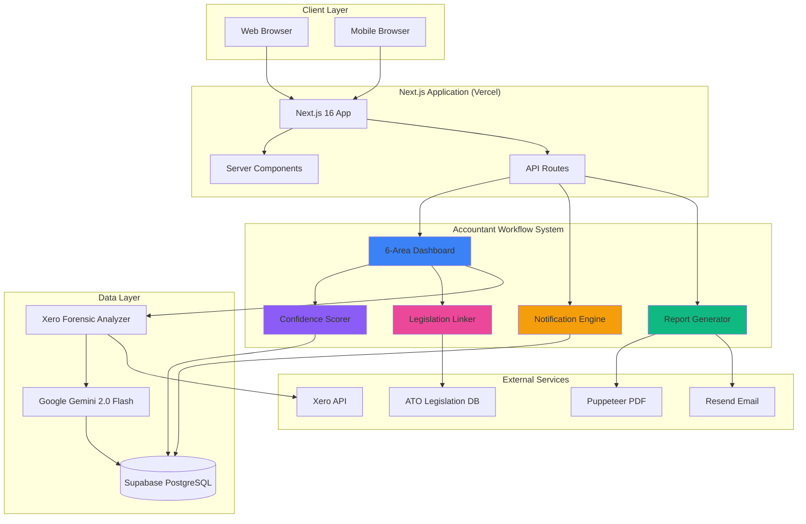
```mermaid
graph TB
    subgraph "Client Layer"
        WEB[Web Browser]
        MOBILE[Mobile Browser]
    end

    subgraph "Next.js Application (Vercel)"
        APP[Next.js 16 App]
        API[API Routes]
        SSR[Server Components]
    end

    subgraph "Accountant Workflow System"
        DASH[6-Area Dashboard]
        NOTIF[Notification Engine]
        REPORT[Report Generator]
        CONF[Confidence Scorer]
        LEG[Legislation Linker]
    end

    subgraph "Data Layer"
        XERO[Xero Forensic Analyzer]
        GEMINI[Google Gemini 2.0 Flash]
        DB[(Supabase PostgreSQL)]
    end

    subgraph "External Services"
        XERO_API[Xero API]
        ATO[ATO Legislation DB]
        RESEND[Resend Email]
        PUPPETEER[Puppeteer PDF]
    end

    WEB --> APP
    MOBILE --> APP
    APP --> SSR
    APP --> API

    API --> DASH
    API --> NOTIF
    API --> REPORT

    DASH --> CONF
    DASH --> LEG
    NOTIF --> DB
    REPORT --> PUPPETEER

    DASH --> XERO
    XERO --> GEMINI
    XERO --> XERO_API
    GEMINI --> DB

    LEG --> ATO
    REPORT --> RESEND
    CONF --> DB

    style DASH fill:#3b82f6
    style NOTIF fill:#f59e0b
    style REPORT fill:#10b981
    style CONF fill:#8b5cf6
    style LEG fill:#ec4899
```

---

## Component Architecture

### 6-Area Dashboard Architecture

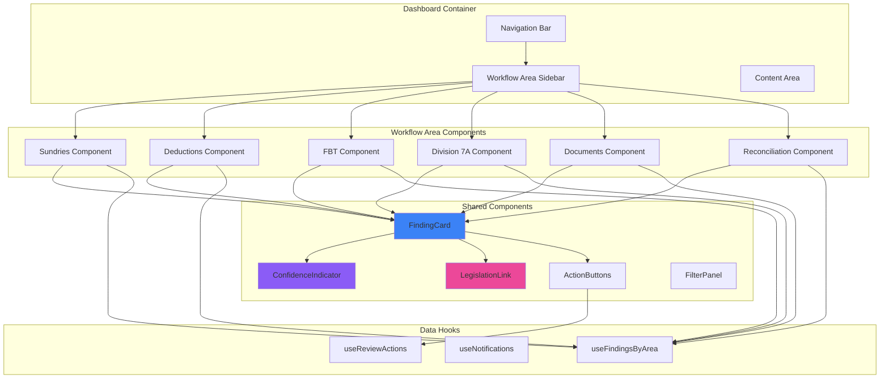
```mermaid
graph TB
    subgraph "Dashboard Container"
        NAV[Navigation Bar]
        SIDEBAR[Workflow Area Sidebar]
        CONTENT[Content Area]
    end

    subgraph "Workflow Area Components"
        SUND[Sundries Component]
        DEDUC[Deductions Component]
        FBT[FBT Component]
        DIV7A[Division 7A Component]
        DOCS[Documents Component]
        RECON[Reconciliation Component]
    end

    subgraph "Shared Components"
        FINDING[FindingCard]
        CONFIDENCE[ConfidenceIndicator]
        LEGISLATION[LegislationLink]
        ACTIONS[ActionButtons]
        FILTER[FilterPanel]
    end

    subgraph "Data Hooks"
        USE_FINDINGS[useFindingsByArea]
        USE_NOTIF[useNotifications]
        USE_REVIEW[useReviewActions]
    end

    NAV --> SIDEBAR
    SIDEBAR --> SUND
    SIDEBAR --> DEDUC
    SIDEBAR --> FBT
    SIDEBAR --> DIV7A
    SIDEBAR --> DOCS
    SIDEBAR --> RECON

    SUND --> FINDING
    DEDUC --> FINDING
    FBT --> FINDING
    DIV7A --> FINDING
    DOCS --> FINDING
    RECON --> FINDING

    FINDING --> CONFIDENCE
    FINDING --> LEGISLATION
    FINDING --> ACTIONS

    SUND --> USE_FINDINGS
    DEDUC --> USE_FINDINGS
    FBT --> USE_FINDINGS
    DIV7A --> USE_FINDINGS
    DOCS --> USE_FINDINGS
    RECON --> USE_FINDINGS

    ACTIONS --> USE_REVIEW

    style FINDING fill:#3b82f6
    style CONFIDENCE fill:#8b5cf6
    style LEGISLATION fill:#ec4899
```

### Notification Engine Architecture

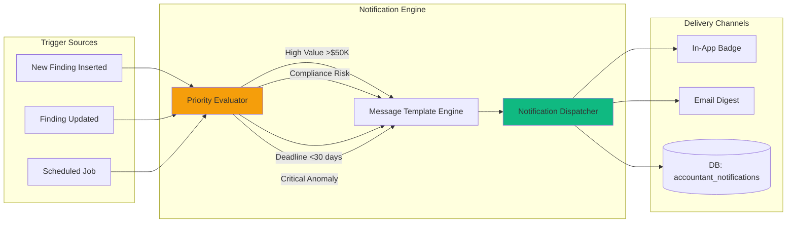
```mermaid
graph LR
    subgraph "Trigger Sources"
        INSERT[New Finding Inserted]
        UPDATE[Finding Updated]
        TIMER[Scheduled Job]
    end

    subgraph "Notification Engine"
        EVALUATOR[Priority Evaluator]
        TEMPLATE[Message Template Engine]
        DISPATCHER[Notification Dispatcher]
    end

    subgraph "Delivery Channels"
        IN_APP[In-App Badge]
        EMAIL[Email Digest]
        DB_NOTIF[(DB: accountant_notifications)]
    end

    INSERT --> EVALUATOR
    UPDATE --> EVALUATOR
    TIMER --> EVALUATOR

    EVALUATOR -->|High Value >$50K| TEMPLATE
    EVALUATOR -->|Compliance Risk| TEMPLATE
    EVALUATOR -->|Deadline <30 days| TEMPLATE
    EVALUATOR -->|Critical Anomaly| TEMPLATE

    TEMPLATE --> DISPATCHER

    DISPATCHER --> IN_APP
    DISPATCHER --> EMAIL
    DISPATCHER --> DB_NOTIF

    style EVALUATOR fill:#f59e0b
    style DISPATCHER fill:#10b981
```

**Priority Evaluation Logic**:
```typescript
function evaluateNotificationPriority(finding: Finding): Priority {
  // Critical: Compliance risk
  if (finding.workflowArea === 'div7a' && finding.findingType === 'non_compliant_loan') {
    return 'critical';
  }
  if (finding.workflowArea === 'fbt' && finding.findingType === 'underreported_liability') {
    return 'critical';
  }

  // High: Large opportunities
  if (finding.amount && finding.amount > 50000) {
    return 'high';
  }

  // Medium: Standard findings
  if (finding.confidenceLevel === 'High') {
    return 'medium';
  }

  // Info: Everything else
  return 'info';
}
```

### Report Generator Architecture

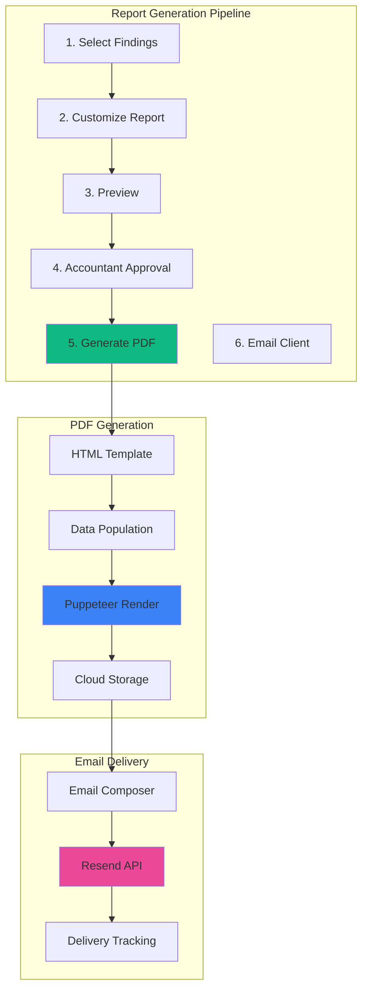
```mermaid
graph TB
    subgraph "Report Generation Pipeline"
        SELECT[1. Select Findings]
        CUSTOMIZE[2. Customize Report]
        PREVIEW[3. Preview]
        APPROVE[4. Accountant Approval]
        GENERATE[5. Generate PDF]
        SEND[6. Email Client]
    end

    subgraph "PDF Generation"
        TEMPLATE[HTML Template]
        POPULATE[Data Population]
        PUPPETEER[Puppeteer Render]
        STORAGE[Cloud Storage]
    end

    subgraph "Email Delivery"
        COMPOSE[Email Composer]
        RESEND[Resend API]
        TRACK[Delivery Tracking]
    end

    SELECT --> CUSTOMIZE
    CUSTOMIZE --> PREVIEW
    PREVIEW --> APPROVE
    APPROVE --> GENERATE

    GENERATE --> TEMPLATE
    TEMPLATE --> POPULATE
    POPULATE --> PUPPETEER
    PUPPETEER --> STORAGE

    STORAGE --> COMPOSE
    COMPOSE --> RESEND
    RESEND --> TRACK

    style GENERATE fill:#10b981
    style PUPPETEER fill:#3b82f6
    style RESEND fill:#ec4899
```

---

## Data Flow Diagrams

### Finding Analysis & Creation Flow

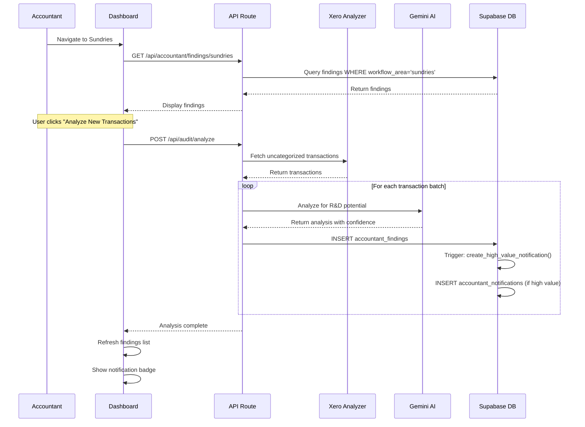
```mermaid
sequenceDiagram
    participant USER as Accountant
    participant DASH as Dashboard
    participant API as API Route
    participant XERO as Xero Analyzer
    participant GEMINI as Gemini AI
    participant DB as Supabase DB

    USER->>DASH: Navigate to Sundries
    DASH->>API: GET /api/accountant/findings/sundries
    API->>DB: Query findings WHERE workflow_area='sundries'
    DB-->>API: Return findings
    API-->>DASH: Display findings

    Note over USER,DASH: User clicks "Analyze New Transactions"

    DASH->>API: POST /api/audit/analyze
    API->>XERO: Fetch uncategorized transactions
    XERO-->>API: Return transactions

    loop For each transaction batch
        API->>GEMINI: Analyze for R&D potential
        GEMINI-->>API: Return analysis with confidence
        API->>DB: INSERT accountant_findings
        DB->>DB: Trigger: create_high_value_notification()
        DB->>DB: INSERT accountant_notifications (if high value)
    end

    API-->>DASH: Analysis complete
    DASH->>DASH: Refresh findings list
    DASH->>DASH: Show notification badge
```

### Confidence Scoring Flow

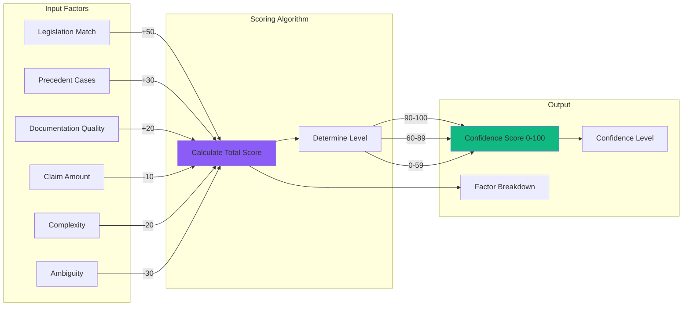
```mermaid
graph LR
    subgraph "Input Factors"
        LEG[Legislation Match]
        PREC[Precedent Cases]
        DOCS[Documentation Quality]
        AMT[Claim Amount]
        CMPLX[Complexity]
        AMBIG[Ambiguity]
    end

    subgraph "Scoring Algorithm"
        CALC[Calculate Total Score]
        LEVEL[Determine Level]
    end

    subgraph "Output"
        SCORE[Confidence Score 0-100]
        LABEL[Confidence Level]
        FACTORS[Factor Breakdown]
    end

    LEG -->|+50| CALC
    PREC -->|+30| CALC
    DOCS -->|+20| CALC
    AMT -->|-10| CALC
    CMPLX -->|-20| CALC
    AMBIG -->|-30| CALC

    CALC --> LEVEL

    LEVEL -->|90-100| SCORE
    LEVEL -->|60-89| SCORE
    LEVEL -->|0-59| SCORE

    SCORE --> LABEL
    CALC --> FACTORS

    style CALC fill:#8b5cf6
    style SCORE fill:#10b981
```

**Scoring Formula**:
```typescript
interface ConfidenceFactors {
  legislationMatch: number;      // 0-50
  precedentCases: number;        // 0-30
  documentationQuality: number;  // 0-20
  amountPenalty: number;         // 0 to -10
  complexityPenalty: number;     // 0 to -20
  ambiguityPenalty: number;      // 0 to -30
}

function calculateConfidenceScore(factors: ConfidenceFactors): number {
  const score =
    factors.legislationMatch +
    factors.precedentCases +
    factors.documentationQuality -
    factors.amountPenalty -
    factors.complexityPenalty -
    factors.ambiguityPenalty;

  return Math.max(0, Math.min(100, score));
}

function determineConfidenceLevel(score: number): 'High' | 'Medium' | 'Low' {
  if (score >= 90) return 'High';
  if (score >= 60) return 'Medium';
  return 'Low';
}
```

### Review & Approval Workflow

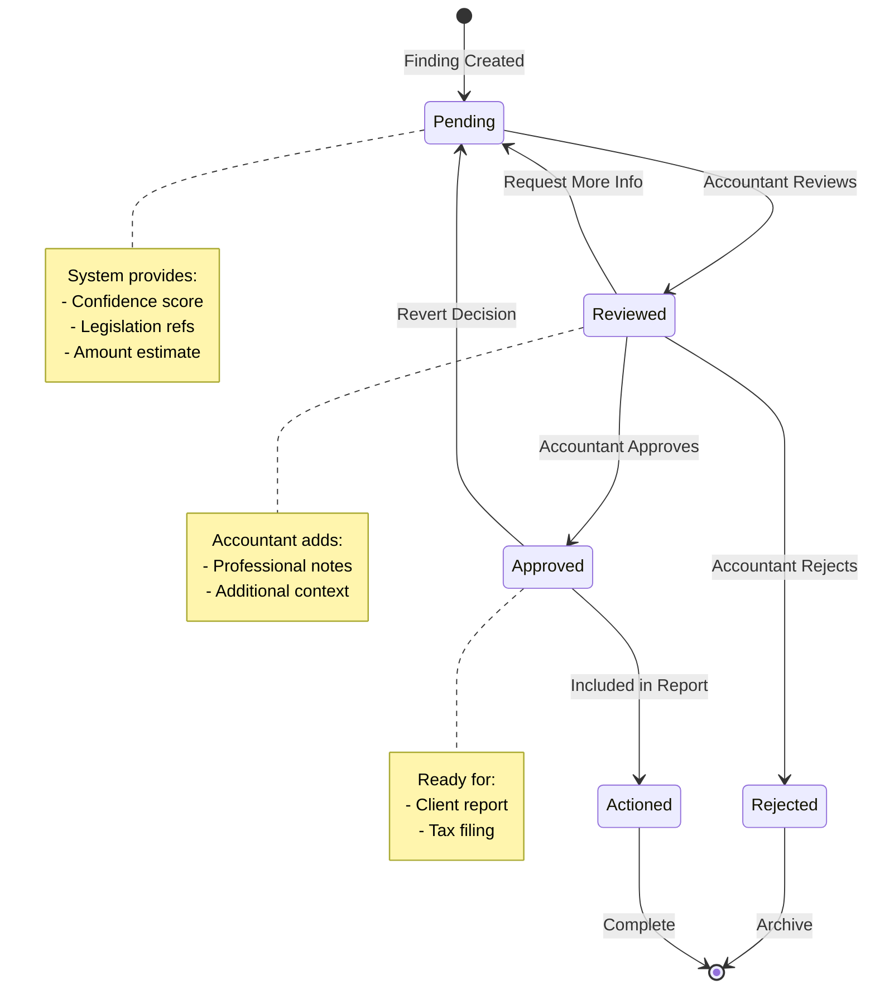
```mermaid
stateDiagram-v2
    [*] --> Pending: Finding Created

    Pending --> Reviewed: Accountant Reviews
    Reviewed --> Approved: Accountant Approves
    Reviewed --> Rejected: Accountant Rejects
    Reviewed --> Pending: Request More Info

    Approved --> Actioned: Included in Report
    Approved --> Pending: Revert Decision

    Rejected --> [*]: Archive
    Actioned --> [*]: Complete

    note right of Pending
        System provides:
        - Confidence score
        - Legislation refs
        - Amount estimate
    end note

    note right of Reviewed
        Accountant adds:
        - Professional notes
        - Additional context
    end note

    note right of Approved
        Ready for:
        - Client report
        - Tax filing
    end note
```

---

## Sequence Diagrams

### Complete Accountant Workflow Sequence

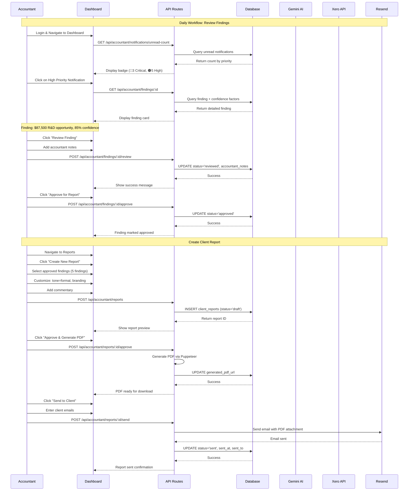
```mermaid
sequenceDiagram
    participant ACC as Accountant
    participant DASH as Dashboard
    participant API as API Routes
    participant DB as Database
    participant GEMINI as Gemini AI
    participant XERO as Xero API
    participant EMAIL as Resend

    Note over ACC,EMAIL: Daily Workflow: Review Findings

    ACC->>DASH: Login & Navigate to Dashboard
    DASH->>API: GET /api/accountant/notifications/unread-count
    API->>DB: Query unread notifications
    DB-->>API: Return count by priority
    API-->>DASH: Display badge (🔴3 Critical, 🟠5 High)

    ACC->>DASH: Click on High Priority Notification
    DASH->>API: GET /api/accountant/findings/:id
    API->>DB: Query finding + confidence factors
    DB-->>API: Return detailed finding
    API-->>DASH: Display finding card

    Note over ACC,DASH: Finding: $87,500 R&D opportunity, 85% confidence

    ACC->>DASH: Click "Review Finding"
    ACC->>DASH: Add accountant notes
    ACC->>API: POST /api/accountant/findings/:id/review
    API->>DB: UPDATE status='reviewed', accountant_notes
    DB-->>API: Success
    API-->>DASH: Show success message

    ACC->>DASH: Click "Approve for Report"
    ACC->>API: POST /api/accountant/findings/:id/approve
    API->>DB: UPDATE status='approved'
    DB-->>API: Success
    API-->>DASH: Finding marked approved

    Note over ACC,EMAIL: Create Client Report

    ACC->>DASH: Navigate to Reports
    ACC->>DASH: Click "Create New Report"
    ACC->>DASH: Select approved findings (5 findings)
    ACC->>DASH: Customize: tone=formal, branding
    ACC->>DASH: Add commentary
    ACC->>API: POST /api/accountant/reports
    API->>DB: INSERT client_reports (status='draft')
    DB-->>API: Return report ID
    API-->>DASH: Show report preview

    ACC->>DASH: Click "Approve & Generate PDF"
    ACC->>API: POST /api/accountant/reports/:id/approve
    API->>API: Generate PDF via Puppeteer
    API->>DB: UPDATE generated_pdf_url
    DB-->>API: Success
    API-->>DASH: PDF ready for download

    ACC->>DASH: Click "Send to Client"
    ACC->>DASH: Enter client emails
    ACC->>API: POST /api/accountant/reports/:id/send
    API->>EMAIL: Send email with PDF attachment
    EMAIL-->>API: Email sent
    API->>DB: UPDATE status='sent', sent_at, sent_to
    DB-->>API: Success
    API-->>DASH: Report sent confirmation
```

### Forensic Analysis Trigger Sequence

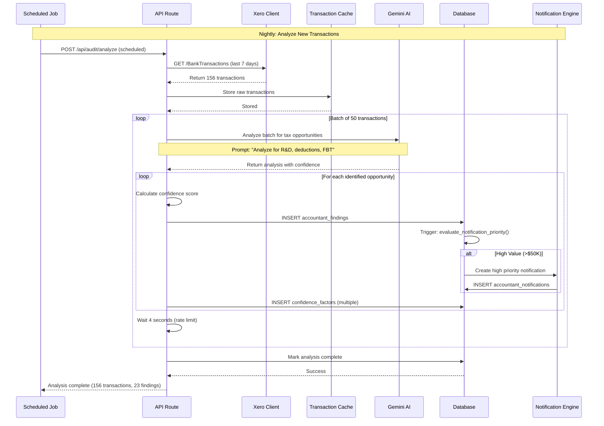
```mermaid
sequenceDiagram
    participant CRON as Scheduled Job
    participant API as API Route
    participant XERO as Xero Client
    participant CACHE as Transaction Cache
    participant GEMINI as Gemini AI
    participant DB as Database
    participant NOTIF as Notification Engine

    Note over CRON,NOTIF: Nightly: Analyze New Transactions

    CRON->>API: POST /api/audit/analyze (scheduled)
    API->>XERO: GET /BankTransactions (last 7 days)
    XERO-->>API: Return 156 transactions
    API->>CACHE: Store raw transactions
    CACHE-->>API: Stored

    loop Batch of 50 transactions
        API->>GEMINI: Analyze batch for tax opportunities
        Note over API,GEMINI: Prompt: "Analyze for R&D, deductions, FBT"
        GEMINI-->>API: Return analysis with confidence

        loop For each identified opportunity
            API->>API: Calculate confidence score
            API->>DB: INSERT accountant_findings
            DB->>DB: Trigger: evaluate_notification_priority()

            alt High Value (>$50K)
                DB->>NOTIF: Create high priority notification
                NOTIF->>DB: INSERT accountant_notifications
            end

            API->>DB: INSERT confidence_factors (multiple)
        end

        API->>API: Wait 4 seconds (rate limit)
    end

    API->>DB: Mark analysis complete
    DB-->>API: Success
    API-->>CRON: Analysis complete (156 transactions, 23 findings)
```

---

## State Machine Diagrams

### Finding Status State Machine

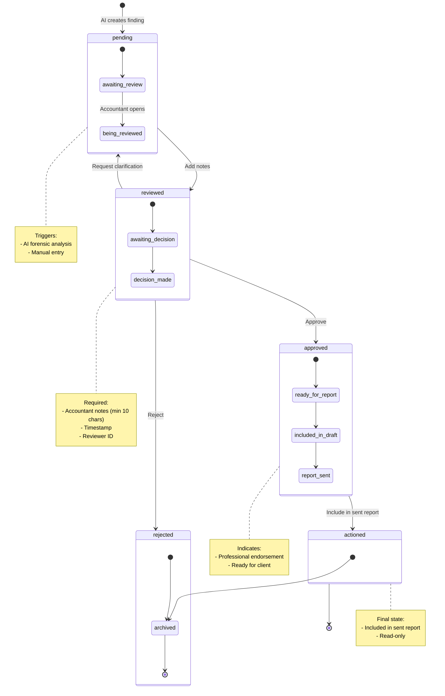
```mermaid
stateDiagram-v2
    [*] --> pending: AI creates finding

    state pending {
        [*] --> awaiting_review
        awaiting_review --> being_reviewed: Accountant opens
    }

    pending --> reviewed: Add notes

    state reviewed {
        [*] --> awaiting_decision
        awaiting_decision --> decision_made
    }

    reviewed --> approved: Approve
    reviewed --> rejected: Reject
    reviewed --> pending: Request clarification

    state approved {
        [*] --> ready_for_report
        ready_for_report --> included_in_draft
        included_in_draft --> report_sent
    }

    approved --> actioned: Include in sent report

    state actioned {
        [*] --> archived
    }

    state rejected {
        [*] --> archived
        archived --> [*]
    }

    actioned --> [*]

    note right of pending
        Triggers:
        - AI forensic analysis
        - Manual entry
    end note

    note right of reviewed
        Required:
        - Accountant notes (min 10 chars)
        - Timestamp
        - Reviewer ID
    end note

    note right of approved
        Indicates:
        - Professional endorsement
        - Ready for client
    end note

    note right of actioned
        Final state:
        - Included in sent report
        - Read-only
    end note
```

### Report Status State Machine

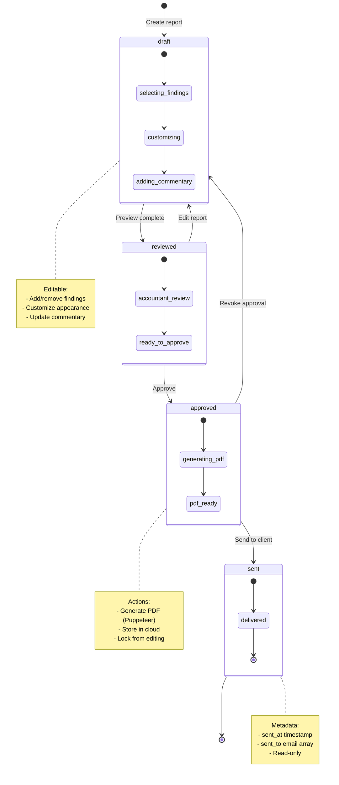
```mermaid
stateDiagram-v2
    [*] --> draft: Create report

    state draft {
        [*] --> selecting_findings
        selecting_findings --> customizing
        customizing --> adding_commentary
    }

    draft --> reviewed: Preview complete

    state reviewed {
        [*] --> accountant_review
        accountant_review --> ready_to_approve
    }

    reviewed --> draft: Edit report
    reviewed --> approved: Approve

    state approved {
        [*] --> generating_pdf
        generating_pdf --> pdf_ready
    }

    approved --> draft: Revoke approval
    approved --> sent: Send to client

    state sent {
        [*] --> delivered
        delivered --> [*]
    }

    sent --> [*]

    note right of draft
        Editable:
        - Add/remove findings
        - Customize appearance
        - Update commentary
    end note

    note right of approved
        Actions:
        - Generate PDF (Puppeteer)
        - Store in cloud
        - Lock from editing
    end note

    note right of sent
        Metadata:
        - sent_at timestamp
        - sent_to email array
        - Read-only
    end note
```

### Notification Lifecycle State Machine

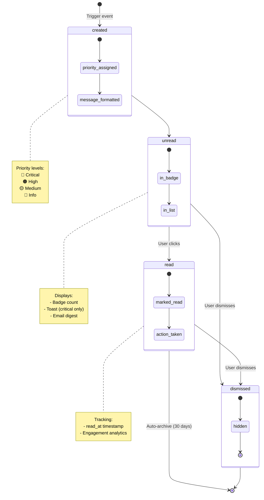
```mermaid
stateDiagram-v2
    [*] --> created: Trigger event

    state created {
        [*] --> priority_assigned
        priority_assigned --> message_formatted
    }

    created --> unread

    state unread {
        [*] --> in_badge
        in_badge --> in_list
    }

    unread --> read: User clicks
    unread --> dismissed: User dismisses

    state read {
        [*] --> marked_read
        marked_read --> action_taken
    }

    read --> dismissed: User dismisses
    read --> [*]: Auto-archive (30 days)

    state dismissed {
        [*] --> hidden
        hidden --> [*]
    }

    dismissed --> [*]

    note right of created
        Priority levels:
        🔴 Critical
        🟠 High
        🟡 Medium
        🔵 Info
    end note

    note right of unread
        Displays:
        - Badge count
        - Toast (critical only)
        - Email digest
    end note

    note right of read
        Tracking:
        - read_at timestamp
        - Engagement analytics
    end note
```

---

## Deployment Architecture

### Production Deployment (Vercel)

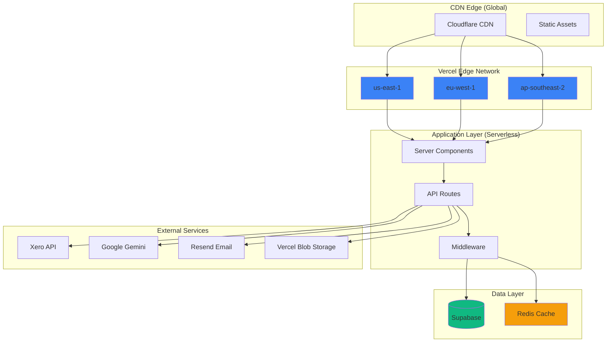
```mermaid
graph TB
    subgraph "CDN Edge (Global)"
        CDN1[Cloudflare CDN]
        CDN2[Static Assets]
    end

    subgraph "Vercel Edge Network"
        EDGE1[us-east-1]
        EDGE2[eu-west-1]
        EDGE3[ap-southeast-2]
    end

    subgraph "Application Layer (Serverless)"
        SSR[Server Components]
        API[API Routes]
        MIDDLEWARE[Middleware]
    end

    subgraph "Data Layer"
        SUPABASE[(Supabase)]
        CACHE[Redis Cache]
    end

    subgraph "External Services"
        XERO[Xero API]
        GEMINI[Google Gemini]
        RESEND[Resend Email]
        STORAGE[Vercel Blob Storage]
    end

    CDN1 --> EDGE1
    CDN1 --> EDGE2
    CDN1 --> EDGE3

    EDGE1 --> SSR
    EDGE2 --> SSR
    EDGE3 --> SSR

    SSR --> API
    API --> MIDDLEWARE

    MIDDLEWARE --> SUPABASE
    MIDDLEWARE --> CACHE

    API --> XERO
    API --> GEMINI
    API --> RESEND
    API --> STORAGE

    style EDGE1 fill:#3b82f6
    style EDGE2 fill:#3b82f6
    style EDGE3 fill:#3b82f6
    style SUPABASE fill:#10b981
    style CACHE fill:#f59e0b
```

### Request Flow Architecture

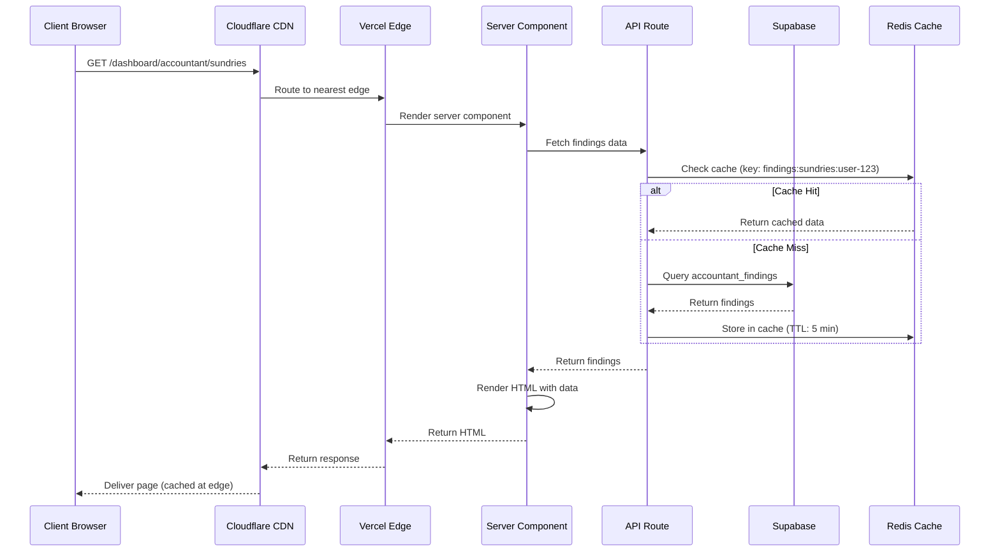
```mermaid
sequenceDiagram
    participant CLIENT as Client Browser
    participant CDN as Cloudflare CDN
    participant EDGE as Vercel Edge
    participant SSR as Server Component
    participant API as API Route
    participant DB as Supabase
    participant CACHE as Redis Cache

    CLIENT->>CDN: GET /dashboard/accountant/sundries
    CDN->>EDGE: Route to nearest edge

    EDGE->>SSR: Render server component
    SSR->>API: Fetch findings data

    API->>CACHE: Check cache (key: findings:sundries:user-123)

    alt Cache Hit
        CACHE-->>API: Return cached data
    else Cache Miss
        API->>DB: Query accountant_findings
        DB-->>API: Return findings
        API->>CACHE: Store in cache (TTL: 5 min)
    end

    API-->>SSR: Return findings
    SSR->>SSR: Render HTML with data
    SSR-->>EDGE: Return HTML
    EDGE-->>CDN: Return response
    CDN-->>CLIENT: Deliver page (cached at edge)
```

### Performance Optimization Strategy

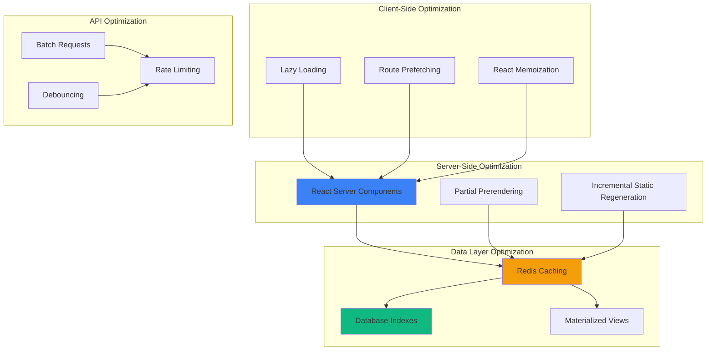
```mermaid
graph TB
    subgraph "Client-Side Optimization"
        LAZY[Lazy Loading]
        PREFETCH[Route Prefetching]
        MEMO[React Memoization]
    end

    subgraph "Server-Side Optimization"
        RSC[React Server Components]
        PARTIAL[Partial Prerendering]
        ISR[Incremental Static Regeneration]
    end

    subgraph "Data Layer Optimization"
        DB_INDEX[Database Indexes]
        MATERIALIZED[Materialized Views]
        REDIS[Redis Caching]
    end

    subgraph "API Optimization"
        BATCH[Batch Requests]
        DEBOUNCE[Debouncing]
        RATE_LIMIT[Rate Limiting]
    end

    LAZY --> RSC
    PREFETCH --> RSC
    MEMO --> RSC

    RSC --> REDIS
    PARTIAL --> REDIS
    ISR --> REDIS

    REDIS --> DB_INDEX
    REDIS --> MATERIALIZED

    BATCH --> RATE_LIMIT
    DEBOUNCE --> RATE_LIMIT

    style RSC fill:#3b82f6
    style REDIS fill:#f59e0b
    style DB_INDEX fill:#10b981
```

**Performance Targets**:
| Metric | Target | Strategy |
|--------|--------|----------|
| Dashboard Load | <2s | Server components + edge caching |
| Finding Retrieval | <500ms | Database indexes + Redis cache |
| Confidence Scoring | <1s | In-memory calculation |
| Report Generation | <10s | Puppeteer optimization + queue |
| Notification Delivery | <30s | Async job processing |

---

## Security Architecture

### Authentication & Authorization Flow

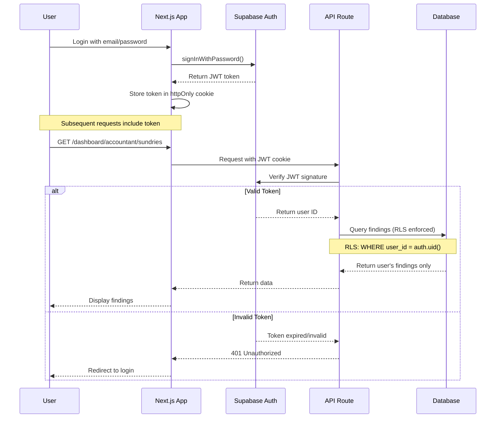
```mermaid
sequenceDiagram
    participant USER as User
    participant APP as Next.js App
    participant SUPABASE as Supabase Auth
    participant API as API Route
    participant DB as Database

    USER->>APP: Login with email/password
    APP->>SUPABASE: signInWithPassword()
    SUPABASE-->>APP: Return JWT token
    APP->>APP: Store token in httpOnly cookie

    Note over USER,APP: Subsequent requests include token

    USER->>APP: GET /dashboard/accountant/sundries
    APP->>API: Request with JWT cookie
    API->>SUPABASE: Verify JWT signature

    alt Valid Token
        SUPABASE-->>API: Return user ID
        API->>DB: Query findings (RLS enforced)
        Note over API,DB: RLS: WHERE user_id = auth.uid()
        DB-->>API: Return user's findings only
        API-->>APP: Return data
        APP-->>USER: Display findings
    else Invalid Token
        SUPABASE-->>API: Token expired/invalid
        API-->>APP: 401 Unauthorized
        APP-->>USER: Redirect to login
    end
```

### Row Level Security (RLS) Enforcement

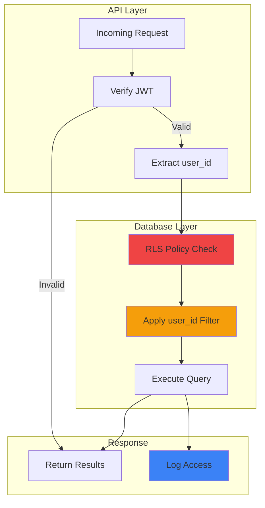
```mermaid
graph TB
    subgraph "API Layer"
        REQ[Incoming Request]
        VERIFY[Verify JWT]
        EXTRACT[Extract user_id]
    end

    subgraph "Database Layer"
        POLICY[RLS Policy Check]
        FILTER[Apply user_id Filter]
        EXECUTE[Execute Query]
    end

    subgraph "Response"
        RETURN[Return Results]
        AUDIT[Log Access]
    end

    REQ --> VERIFY
    VERIFY -->|Valid| EXTRACT
    VERIFY -->|Invalid| RETURN

    EXTRACT --> POLICY
    POLICY --> FILTER
    FILTER --> EXECUTE

    EXECUTE --> RETURN
    EXECUTE --> AUDIT

    style POLICY fill:#ef4444
    style FILTER fill:#f59e0b
    style AUDIT fill:#3b82f6
```

**RLS Policy Examples**:
```sql
-- Users can only view their own findings
CREATE POLICY "Users can view own findings"
  ON accountant_findings
  FOR SELECT
  USING (auth.uid() = user_id);

-- Users can only update findings they created
CREATE POLICY "Users can update own findings"
  ON accountant_findings
  FOR UPDATE
  USING (auth.uid() = user_id);

-- Prevent cross-tenant data access
CREATE POLICY "Enforce tenant isolation"
  ON accountant_findings
  FOR ALL
  USING (
    tenant_id IN (
      SELECT tenant_id FROM user_organisations
      WHERE user_id = auth.uid()
    )
  );
```

---

## Integration Diagrams

### Xero Integration Architecture

```mermaid
graph LR
    subgraph "ATO Platform"
        API[API Routes]
        XERO_CLIENT[Xero Client]
        CACHE[Transaction Cache]
        ANALYZER[Forensic Analyzer]
    end

    subgraph "Xero API"
        OAUTH[OAuth 2.0]
        BANK_TX[/BankTransactions]
        INVOICES[/Invoices]
        CONTACTS[/Contacts]
        REPORTS[/Reports]
    end

    subgraph "Storage"
        DB[(Supabase)]
        REDIS[(Redis Cache)]
    end

    API --> XERO_CLIENT
    XERO_CLIENT --> OAUTH
    OAUTH --> BANK_TX
    OAUTH --> INVOICES
    OAUTH --> CONTACTS
    OAUTH --> REPORTS

    BANK_TX --> CACHE
    INVOICES --> CACHE
    REPORTS --> CACHE

    CACHE --> REDIS
    CACHE --> DB

    ANALYZER --> CACHE

    style OAUTH fill:#ec4899
    style CACHE fill:#f59e0b
```

**Integration Points**:
| Xero Endpoint | Purpose | Frequency | Cache TTL |
|---------------|---------|-----------|-----------|
| /BankTransactions | Forensic analysis | Daily | 24 hours |
| /Invoices | FBT analysis | Weekly | 7 days |
| /Contacts | Shareholder identification | On-demand | 30 days |
| /Reports/ProfitAndLoss | Section 8-1 deductions | Monthly | 30 days |

---

## Monitoring & Observability

### Metrics Collection Architecture

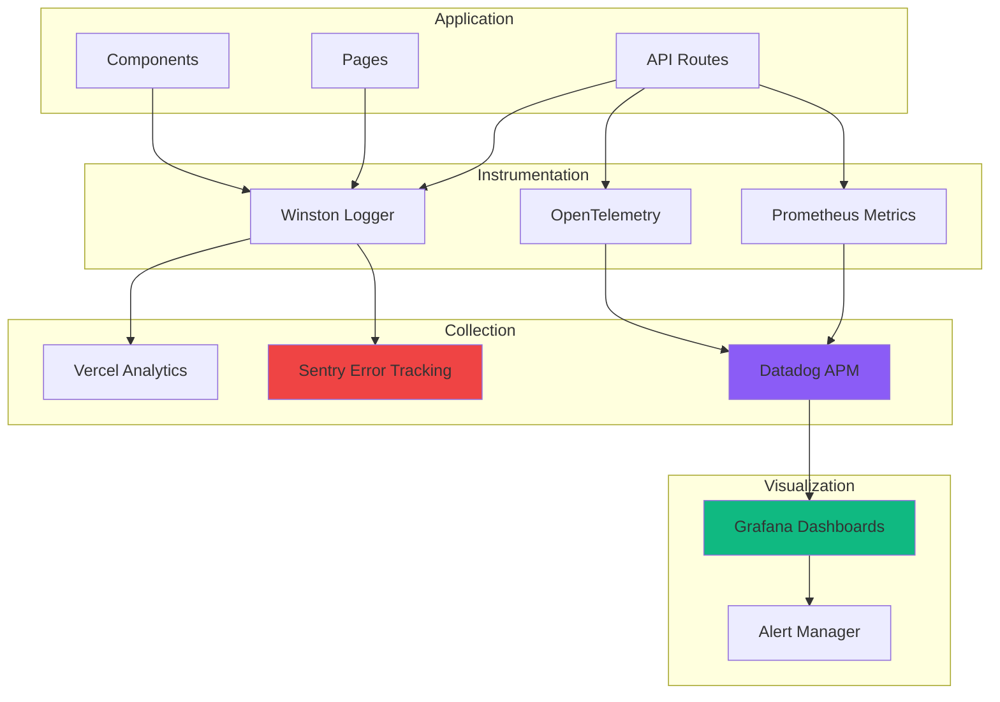
```mermaid
graph TB
    subgraph "Application"
        API[API Routes]
        PAGES[Pages]
        COMPONENTS[Components]
    end

    subgraph "Instrumentation"
        LOGGER[Winston Logger]
        METRICS[Prometheus Metrics]
        TRACES[OpenTelemetry]
    end

    subgraph "Collection"
        VERCEL[Vercel Analytics]
        SENTRY[Sentry Error Tracking]
        DATADOG[Datadog APM]
    end

    subgraph "Visualization"
        GRAFANA[Grafana Dashboards]
        ALERTS[Alert Manager]
    end

    API --> LOGGER
    API --> METRICS
    API --> TRACES

    PAGES --> LOGGER
    COMPONENTS --> LOGGER

    LOGGER --> VERCEL
    LOGGER --> SENTRY

    METRICS --> DATADOG
    TRACES --> DATADOG

    DATADOG --> GRAFANA
    GRAFANA --> ALERTS

    style SENTRY fill:#ef4444
    style DATADOG fill:#8b5cf6
    style GRAFANA fill:#10b981
```

**Key Metrics Tracked**:
```typescript
// Performance metrics
metrics.histogram('api_response_time', {
  endpoint: '/api/accountant/findings',
  status: 200,
  duration_ms: 245
});

// Business metrics
metrics.counter('findings_created', {
  workflow_area: 'sundries',
  confidence_level: 'High'
});

// Error tracking
logger.error('Xero API rate limit exceeded', {
  endpoint: '/BankTransactions',
  tenant_id: 'abc-123',
  retry_after: 60
});
```

---

**System Diagrams Status**: Complete
**Total Diagrams**: 20
**Diagram Types**: Architecture, Component, Flow, Sequence, State, Deployment, Security
**Next**: Risk assessment document (deliverable 5 of 5)
